# Flowchart: `init` Command Execution

**Feature**: Project Initialization  
**Module**: `src/specify_cli/__init__.py:445–1089`  
**Generated**: 2026-05-16  

---

## Control Flow Diagram

```mermaid
flowchart TD
    Start(["`specify init [args]`"]) --> Banner["Show banner & init state"]
    Banner --> ValidArgs{"Validate arguments:<br/>- ai vs integration<br/>- project_name vs --here<br/>- branch_numbering<br/>- ai_skills requires ai"}
    
    ValidArgs -->|Invalid| ErrorExit1["❌ Error exit(1)<br/>Show error message"]
    ValidArgs -->|Valid| ResolveDir["Resolve project path"]
    
    ResolveDir --> DirCheck{"Directory<br/>already<br/>exists?"}
    
    DirCheck -->|Yes, not --here| ExistingDir["Show conflict panel:<br/>1. OK with --force?<br/>2. Else error exit(1)"]
    ExistingDir -->|No| ErrorExit1
    ExistingDir -->|Yes| DirReady["✓ Ready for merge"]
    
    DirCheck -->|No| CreateReady["✓ Will create new dir"]
    DirCheck -->|Here| CurDirReady["✓ Use current dir"]
    
    CurDirReady --> CheckEmpty{"Directory<br/>empty?"}
    CheckEmpty -->|No| AskMerge{"--force?"}
    AskMerge -->|No| Decline["User declines merge"]
    Decline --> CancelExit0["⚠️ Cancel exit(0)"]
    AskMerge -->|Yes| DirReady
    CheckEmpty -->|Yes| DirReady
    
    CreateReady --> IntegrationRes["Integration Resolution"]
    DirReady --> IntegrationRes
    CancelExit0 --> End1(["End: No changes"])
    
    IntegrationRes --> HasIntegration{"--integration or<br/>--ai provided?"}
    HasIntegration -->|Yes| ResolveIntegration["Get integration metadata"]
    HasIntegration -->|No| InteractiveSelect{"Interactive<br/>stdin?"}
    
    InteractiveSelect -->|Yes| Menu["Show agent selection menu<br/>DEFAULT = DEFAULT_INIT_INTEGRATION"]
    InteractiveSelect -->|No| DefaultAgent["Use DEFAULT_INIT_INTEGRATION"]
    
    Menu --> IntegrationKey
    DefaultAgent --> IntegrationKey["selected_ai := agent key"]
    ResolveIntegration --> IntegrationKey
    
    IntegrationKey --> ValidateIntegration{"Integration<br/>found?"}
    ValidateIntegration -->|No| ErrorExit1
    ValidateIntegration -->|Yes| GenericCheck{"Integration<br/>== generic?"}
    
    GenericCheck -->|Yes| HasCmdDir{"--ai-commands-dir or<br/>--integration-options<br/>provided?"}
    HasCmdDir -->|No| ErrorExit1
    HasCmdDir -->|Yes| ToolCheck
    
    GenericCheck -->|No| ToolCheck["Tool Availability Check"]
    
    ToolCheck --> IgnoreTools{"--ignore-agent-tools?"}
    IgnoreTools -->|Yes| ScriptSelect
    IgnoreTools -->|No| AgentRequiresCLI{"Agent<br/>requires_cli?"}
    
    AgentRequiresCLI -->|Yes| AgentFound{"Agent CLI<br/>installed?"}
    AgentFound -->|No| ErrorExit1
    AgentFound -->|Yes| ScriptSelect["Script Type Selection"]
    AgentRequiresCLI -->|No| ScriptSelect
    
    ScriptSelect --> HasScriptType{"--script<br/>provided?"}
    HasScriptType -->|Yes| ValidateScript{"Valid script<br/>type?"}
    ValidateScript -->|No| ErrorExit1
    ValidateScript -->|Yes| ScriptSelected
    
    HasScriptType -->|No| InteractiveScript{"Interactive<br/>stdin?"}
    InteractiveScript -->|Yes| MenuScript["Show script menu<br/>DEFAULT = OS-appropriate"]
    InteractiveScript -->|No| DefaultScript["DEFAULT = OS-appropriate"]
    
    MenuScript --> ScriptSelected["selected_script := type"]
    DefaultScript --> ScriptSelected
    
    ScriptSelected --> ShowPanel["Show setup panel:<br/>Project / Path / Agent / Script"]
    
    ShowPanel --> GitCheck["Check git tool<br/>unless --no-git"]
    GitCheck --> OrchestrationStart["Begin Orchestration<br/>with StepTracker"]
    
    OrchestrationStart --> Step1["Step 1: Integration Setup<br/>→ IntegrationManifest<br/>→ integration.setup()<br/>→ manifest.save()"]
    Step1 --> Step2["Step 2: Shared Infrastructure<br/>→ _install_shared_infra_or_exit<br/>→ ensure_constitution"]
    
    Step2 --> Step3["Step 3: Git Setup<br/>IF NOT --no-git:<br/>  1. Check if repo exists<br/>  2. Init if needed<br/>  3. Install git extension"]
    
    Step3 --> Step4["Step 4: Workflow Installation<br/>→ Locate bundled 'speckit'<br/>→ Copy to .specify/workflows<br/>→ Register in WorkflowRegistry"]
    
    Step4 --> Step5["Step 5: Fix Permissions<br/>→ ensure_executable_scripts"]
    
    Step5 --> Step6["Step 6: Persist Init Options<br/>→ save_init_options<br/>  {ai, integration, script, ...}<br/>  → .specify/init.json"]
    
    Step6 --> PresetInstall{"--preset<br/>provided?"}
    PresetInstall -->|No| PostInit["Post-Init Messages"]
    PresetInstall -->|Yes| PresetFallback["Preset Installation Chain:<br/>1. Try local dir<br/>2. Try bundled<br/>3. Try catalog<br/>4. Download from remote"]
    
    PresetFallback --> PresetResult{"Preset<br/>installed?"}
    PresetResult -->|Error| PresetWarn["⚠️ Warn (non-fatal)"]
    PresetResult -->|Success| PresetOK["✓ Preset ready"]
    
    PresetWarn --> PostInit
    PresetOK --> PostInit
    
    PostInit --> Messages["Display Messages:<br/>- Agent folder security notice<br/>- Deprecation warnings<br/>- Git extension default notice<br/>- Next steps panel"]
    
    Messages --> Success["✓ Project ready<br/>exit(0)"]
    
    Success --> End2(["End: Success"])
    
    Step1 -->|Exception| ErrorHandler["Error Handler:<br/>- Tracker.error()<br/>- Show error panel<br/>- If new dir:<br/>  Clean up project path<br/>- exit(1)"]
    Step2 -->|Exception| ErrorHandler
    Step3 -->|Exception| ErrorHandler
    Step4 -->|Exception| ErrorHandler
    Step5 -->|Exception| ErrorHandler
    Step6 -->|Exception| ErrorHandler
    
    ErrorHandler --> End3(["End: Failure"])
    ErrorExit1 --> End4(["End: Error"])
```



---

## State Transitions

### Initialization States

```
┌─────────────────┐
│   START: init   │
└────────┬────────┘
         │
         ▼
┌─────────────────────┐
│  PHASE 1: VALIDATE  │ (Lines 506–599)
└────────┬────────────┘
         │ ✓ Valid parameters
         ▼
┌──────────────────────┐
│ PHASE 2: RESOLVE DIR │ (Lines 600–642)
└────────┬─────────────┘
         │ ✓ Path ready
         ▼
┌──────────────────────────┐
│ PHASE 3: INTEGRATION RES │ (Lines 644–678)
└────────┬─────────────────┘
         │ ✓ Integration found
         ▼
┌─────────────────────┐
│ PHASE 4: TOOL CHECK │ (Lines 680–732)
└────────┬────────────┘
         │ ✓ Tools available
         ▼
┌──────────────────────────────┐
│ PHASE 5: ORCHESTRATION START │ (Lines 734–759)
└────────┬─────────────────────┘
         │ ✓ Tracker initialized
         ▼
┌──────────────────────┐
│ STEP 1: INTEGRATION  │ (Lines 764–807)
└────────┬─────────────┘
         │ ✓ Integration setup done
         ▼
┌──────────────────────┐
│ STEP 2: SHARED INFRA │ (Lines 810–820)
└────────┬─────────────┘
         │ ✓ Templates, scripts installed
         ▼
┌──────────────────────┐
│ STEP 3: GIT SETUP    │ (Lines 822–872)
└────────┬─────────────┘
         │ ✓ Git initialized
         ▼
┌──────────────────────────┐
│ STEP 4: WORKFLOW INSTALL │ (Lines 874–903)
└────────┬─────────────────┘
         │ ✓ Workflow registry ready
         ▼
┌──────────────────────┐
│ STEP 5: FIX PERMS    │ (Line 906)
└────────┬─────────────┘
         │ ✓ Scripts executable
         ▼
┌──────────────────────┐
│ STEP 6: PERSIST OPTS │ (Lines 908–927)
└────────┬─────────────┘
         │ ✓ init.json saved
         ▼
┌─────────────────────────┐
│ STEP 7: PRESET INSTALL  │ (Lines 929–975)
└────────┬────────────────┘
         │ ✓ Preset installed (optional)
         ▼
┌──────────────────────┐
│ PHASE 6: POST-INIT   │ (Lines 998–1089)
└────────┬─────────────┘
         │ ✓ Messages displayed
         ▼
┌────────────────────────┐
│ SUCCESS: exit(0)       │
│ OR CANCEL: exit(0)     │
│ OR ERROR: exit(1)      │
└────────────────────────┘
```

---

## Decision Points

### 1. Directory Handling

```
┌──────────────┐
│ --here flag? │
├──────────────┤
│ Y → current  │
│ N → resolve  │
└──────────────┘
     │
     ├─→ Exists? ─→ Y ─→ --force? ─→ Y ─→ Merge
     │             │    └─→ N ──→ Ask User
     │             └─→ N ─→ Create New
     └─→ Not exists? ─→ Create New
```

### 2. Agent Selection

```
┌──────────────────────────┐
│ --integration or --ai?   │
├──────────────────────────┤
│ Y → Use provided         │
│ N → Interactive or Dflt  │
└──────────────────────────┘
```

### 3. Script Type Selection

```
┌─────────────────────┐
│ --script provided?  │
├─────────────────────┤
│ Y → Validate & Use  │
│ N → Interactive or  │
│     OS-appropriate  │
└─────────────────────┘
```

### 4. Preset Installation

```
┌────────────────┐
│ --preset?      │
├────────────────┤
│ N → Skip       │
│ Y → Fallback:  │
│     1. Local   │
│     2. Bundled │
│     3. Catalog │
└────────────────┘
```

---

## Error Flows

### Fatal Errors (exit 1)

1. **Parameter validation fails** → Show error → exit(1)
2. **Integration not found** → Show available list → exit(1)
3. **Agent tool not found** → Show install panel → exit(1)
4. **Directory conflict (no --force)** → Show conflict panel → exit(1)
5. **Exception during orchestration** → Show error panel → cleanup → exit(1)

### Non-Fatal Warnings

1. **Git not found** → Warn, continue without git
2. **Preset not found** → Warn, continue without preset
3. **Extension installation failed** → Warn, continue

### User Cancellation

1. **User declines merge prompt (--here, not empty, no --force)** → exit(0) [success, no changes]

---

## Concurrency & Synchronization

- **No concurrent operations**: All steps execute sequentially
- **Live UI**: `StepTracker` renders in `Live()` context with 8 refreshes/second
- **No locks**: Filesystem operations assume exclusive write access to `project_path`

---

## Performance Characteristics

| Operation | Complexity | Notes |
|-----------|-----------|-------|
| Parameter validation | O(1) | Simple checks, no I/O |
| Integration resolution | O(n) where n = # installed integrations | Linear lookup in AGENT_CONFIG |
| Tool detection | O(1) per tool | Calls `check_tool()` (which, where) |
| Directory I/O | O(m) where m = files to copy | Shared infra, templates bundled in wheel |
| Git init | O(1) | Subprocess call (external) |
| Workflow install | O(k) where k = workflow files | File copies, YAML parse |
| Preset download | O(z) where z = preset size | Network I/O (remote) |

---

## Key Decision Criteria

| Criterion | Affects | Logic |
|-----------|---------|-------|
| `--here` flag | Directory resolution | Current vs new |
| `--force` flag | Conflict resolution | Merge vs error |
| Interactive stdin | Selection | Menu vs default |
| `--ignore-agent-tools` | Tool check | Skip vs enforce |
| `--no-git` flag | Git setup | Skip vs required |
| Platform (`os.name`) | Script type default | Windows → ps, Unix → sh |
| Agent `requires_cli` | Tool check | Conditional enforcement |

