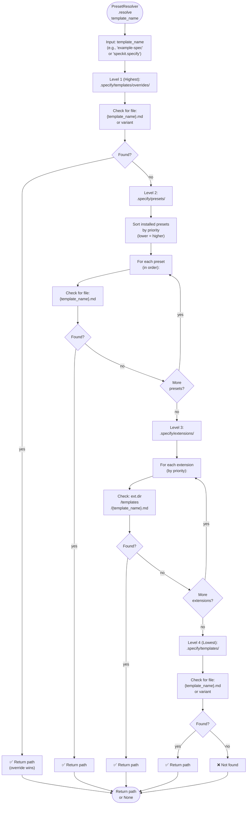
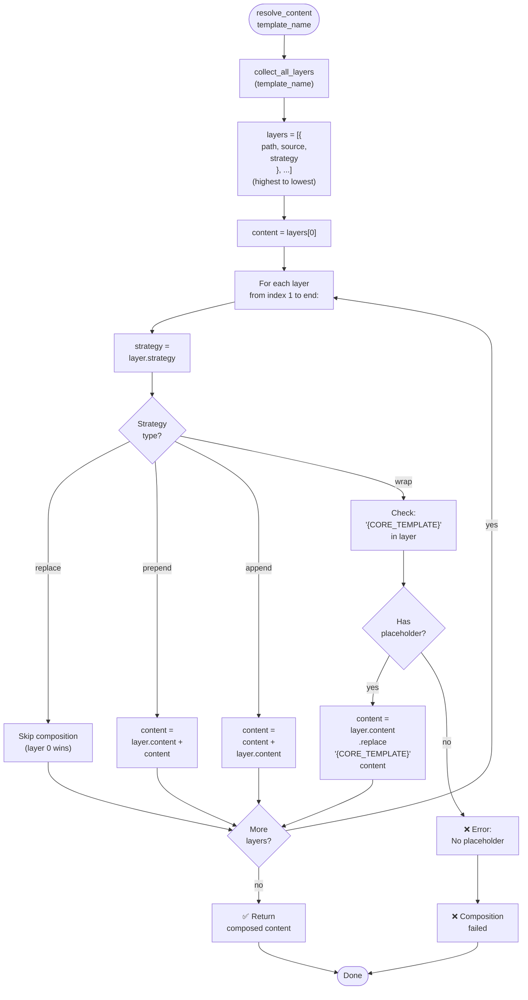
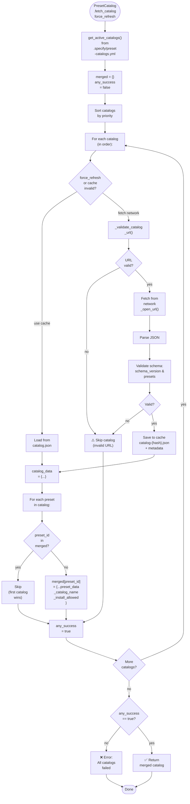
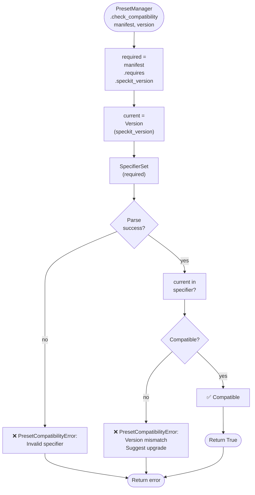

# Flowcharts — Preset Module

**Generated**: 2026-05-17  
**Module**: preset (Preset Management System)

---

## 1. Installation Flow

Preset installation orchestration from discovery through persistence.

```mermaid
flowchart TD
    START([User: install preset]) --> INPUT["INPUT: preset_id, source_type<br/>(remote|local)"]
    
    INPUT --> FETCH{Source Type?}
    FETCH -->|remote| FETCH_CAT["1. PresetCatalog<br/>.fetch_catalog()"]
    FETCH -->|local| LOAD_LOCAL["1. Load from<br/>local source"]
    
    FETCH_CAT --> FOR_CAT["For each active catalog<br/>(by priority):"]
    FOR_CAT --> SINGLE["_fetch_single_catalog()<br/>with cache check"]
    SINGLE --> CACHE{"Cache<br/>valid?"}
    CACHE -->|yes| USE_CACHE["Load from cache"]
    CACHE -->|no| NETWORK["Fetch from network"]
    NETWORK --> SAVE_CACHE["Save to cache<br/>(1h TTL)"]
    SAVE_CACHE --> MERGE["Merge into result"]
    MERGE --> NEXT_CAT{More<br/>catalogs?}
    NEXT_CAT -->|yes| FOR_CAT
    NEXT_CAT -->|no| MERGED["Catalog merged<br/>(priority-based)"]
    USE_CACHE --> MERGE
    
    LOAD_LOCAL --> VALIDATE_PATH["Validate source<br/>directory exists"]
    MERGED --> MANIFEST["2. Load manifest<br/>(preset.yml)"]
    VALIDATE_PATH --> MANIFEST
    
    MANIFEST --> LOAD_YAML["PresetManifest<br/>._load_yaml()"]
    LOAD_YAML --> YAML_ERR{"Valid<br/>YAML?"}
    YAML_ERR -->|no| ERR1["❌ PresetValidationError:<br/>Invalid YAML"]
    
    YAML_ERR -->|yes| VALIDATE["_validate()<br/>manifest schema"]
    VALIDATE --> CHK_REQUIRED["Check required<br/>fields"]
    CHK_REQUIRED --> CHK_TEMPLATES["Check ≥1 template"]
    CHK_TEMPLATES --> CHK_STRATEGY["Validate template<br/>strategies"]
    CHK_STRATEGY --> VALID_ERR{Validation<br/>pass?}
    
    VALID_ERR -->|no| ERR1
    VALID_ERR -->|yes| COMPAT["3. Check compatibility"]
    
    COMPAT --> GET_VER["Get speckit version"]
    GET_VER --> CHK_SPEC["Check: current ∈<br/>preset.requires.speckit_version"]
    CHK_SPEC --> COMPAT_ERR{Compatible?}
    
    COMPAT_ERR -->|no| ERR2["❌ PresetCompatibilityError:<br/>Version mismatch"]
    COMPAT_ERR -->|yes| COPY["4. Copy preset"]
    
    COPY --> IF_REMOTE{Remote<br/>source?}
    IF_REMOTE -->|yes| DOWNLOAD["download_preset()<br/>→ ZIP"]
    IF_REMOTE -->|no| FROM_LOCAL["Use local files"]
    
    DOWNLOAD --> URL_CHECK["Validate URL:<br/>HTTPS only<br/>(except localhost)"]
    URL_CHECK --> URL_ERR{Valid?}
    URL_ERR -->|no| ERR3["❌ SecurityError:<br/>Invalid URL"]
    URL_ERR -->|yes| DL_ZIP["Download ZIP<br/>via _open_url()"]
    DL_ZIP --> DL_ERR{Success?}
    DL_ERR -->|no| ERR4["❌ NetworkError"]
    DL_ERR -->|yes| EXTRACT["Extract ZIP<br/>to temp dir"]
    
    EXTRACT --> COPY_DIR["5. shutil.copytree<br/>→ .specify/presets/{preset_id}"]
    FROM_LOCAL --> COPY_DIR
    
    COPY_DIR --> IGNORE["Load .presetignore<br/>(if exists)"]
    IGNORE --> IGNORE_FUNC["Create ignore function"]
    IGNORE_FUNC --> COPYTREE["copytree(src, dst,<br/>ignore=ignore_func)"]
    COPYTREE --> COPY_ERR{Copy<br/>success?}
    COPY_ERR -->|no| ERR5["❌ IOError:<br/>Copy failed"]
    COPY_ERR -->|yes| COMPOSE["6. Compose templates<br/>(non-replace)"]
    
    COMPOSE --> FOR_TMPL["For each template"]
    FOR_TMPL --> CHK_STRAT{"Strategy<br/>!=<br/>replace?"}
    CHK_STRAT -->|no| SKIP_COMP["Skip compose"]
    CHK_STRAT -->|yes| GET_LAYERS["collect_all_layers<br/>(template_name)"]
    GET_LAYERS --> IS_TOP{"This preset<br/>top<br/>layer?"}
    IS_TOP -->|no| SKIP_COMP
    IS_TOP -->|yes| COMPOSE_IT["resolve_content()<br/>compose layers"]
    COMPOSE_IT --> COMP_ERR{Success?}
    COMP_ERR -->|no| ERR6["❌ Validation:<br/>No base layer"]
    COMP_ERR -->|yes| WRITE_COMP["Write to<br/>.composed/{name}"]
    WRITE_COMP --> NEXT_TMPL{More<br/>templates?}
    SKIP_COMP --> NEXT_TMPL
    NEXT_TMPL -->|yes| FOR_TMPL
    NEXT_TMPL -->|no| REGISTER_CMD["7. Register commands<br/>with agents"]
    
    REGISTER_CMD --> EXTRACT_CMD["Extract command<br/>templates"]
    EXTRACT_CMD --> FILTER_EXT["Filter: skip extension<br/>commands if ext<br/>not installed"]
    FILTER_EXT --> REGISTRAR["CommandRegistrar<br/>.register_commands<br/>_for_all_agents()"]
    REGISTRAR --> REG_ERR{Success?}
    REG_ERR -->|no| ERR7["❌ IOError:<br/>Registration failed"]
    REG_ERR -->|yes| RECONCILE["8. Reconcile<br/>all command files"]
    
    RECONCILE --> FOR_CMD_REC["For each command<br/>file in agent dirs"]
    FOR_CMD_REC --> RESOLVE_FINAL["resolve_content()<br/>final composition"]
    RESOLVE_FINAL --> WRITE_FINAL["Overwrite with<br/>correct content"]
    WRITE_FINAL --> NEXT_REC{More?}
    NEXT_REC -->|yes| FOR_CMD_REC
    NEXT_REC -->|no| PERSIST["9. Persist to registry"]
    
    PERSIST --> REGISTRY["PresetRegistry<br/>.add()"]
    REGISTRY --> SAVE_REG["Save to .registry<br/>(JSON)"]
    SAVE_REG --> SUCCESS["✅ Install complete"]
    
    ERR1 --> CLEANUP1["Cleanup:"]
    ERR2 --> CLEANUP1
    ERR3 --> CLEANUP1
    ERR4 --> CLEANUP1
    ERR5 --> CLEANUP1
    ERR6 --> CLEANUP1
    ERR7 --> CLEANUP1
    
    CLEANUP1 --> DEL_DIR["Delete .specify/presets<br/>/{preset_id}"]
    DEL_DIR --> UNREG_CMD["Unregister agent<br/>commands"]
    UNREG_CMD --> FAIL["❌ Installation failed"]
    
    SUCCESS --> END([Done])
    FAIL --> END
```



---

## 2. Manifest Validation Details

Detailed breakdown of validation rules.

```mermaid
flowchart TD
    START([Manifest<br/>._validate()]) --> R1["✓ Required fields:<br/>'schema_version'<br/>'preset'<br/>'requires'<br/>'provides'"]
    
    R1 --> R1_ERR{All<br/>present?}
    R1_ERR -->|no| ERR["❌ Missing<br/>required field"]
    R1_ERR -->|yes| R2["✓ schema_version<br/>== '1.0'"]
    
    R2 --> R2_ERR{Match?}
    R2_ERR -->|no| ERR
    R2_ERR -->|yes| R3["✓ preset.id<br/>matches ^[a-z0-9-]+$"]
    
    R3 --> R3_ERR{Valid?}
    R3_ERR -->|no| ERR
    R3_ERR -->|yes| R4["✓ preset.version<br/>is semantic version"]
    
    R4 --> R4_ERR{Valid?}
    R4_ERR -->|no| ERR
    R4_ERR -->|yes| R5["✓ requires<br/>.speckit_version<br/>present"]
    
    R5 --> R5_ERR{Present?}
    R5_ERR -->|no| ERR
    R5_ERR -->|yes| R6["✓ provides.templates<br/>is non-empty list"]
    
    R6 --> R6_ERR{Valid?}
    R6_ERR -->|no| ERR
    R6_ERR -->|yes| R7["✓ For each template:<br/>name, type, file"]
    
    R7 --> R7_ERR{Valid?}
    R7_ERR -->|no| ERR
    R7_ERR -->|yes| R8["✓ Template type ∈<br/>{template, command<br/>script}"]
    
    R8 --> R8_ERR{Valid?}
    R8_ERR -->|no| ERR
    R8_ERR -->|yes| R9["✓ Template strategy<br/>∈ VALID_STRATEGIES"]
    
    R9 --> R9_ERR{Valid?}
    R9_ERR -->|no| ERR
    R9_ERR -->|yes| R10["✓ Script strategy<br/>∈ {replace, wrap}"]
    
    R10 --> R10_ERR{Valid?}
    R10_ERR -->|no| ERR
    R10_ERR -->|yes| SUCCESS["✅ Validation<br/>passed"]
    
    ERR --> RAISE["raise<br/>PresetValidationError"]
    SUCCESS --> END([Return<br/>manifest])
    RAISE --> END
```

---

## 3. Template Resolution Stack

How templates are resolved via 4-level priority hierarchy.



---

## 4. Template Composition Algorithm

How multiple template layers are composed based on strategy.



---

## 5. Catalog Fetching with Cache

Multi-catalog merge with intelligent caching.



---

## 6. Compatibility Check

Preset compatibility validation.



---

## Summary

| Flow | Purpose | Key Decision Points |
|------|---------|-------------------|
| **Installation** | End-to-end preset setup | Fetch source → Validate → Compose → Register → Persist |
| **Validation** | Enforce manifest schema | Required fields, version, templates, strategies |
| **Resolution** | Find templates via 4-level stack | Override → Preset → Extension → Core |
| **Composition** | Merge multiple template layers | Strategy type → Layer combination |
| **Catalog** | Discover & cache presets | Priority-based merge, cache validity, fallback tolerance |
| **Compatibility** | Check version safety | Specifier validation, version matching |
