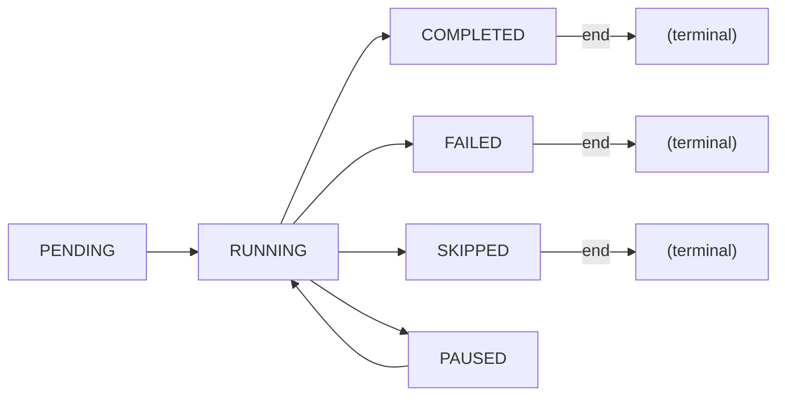
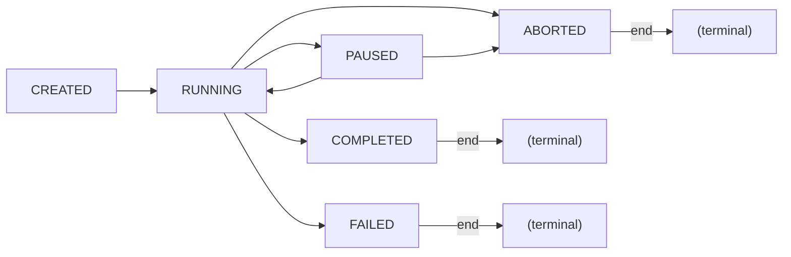
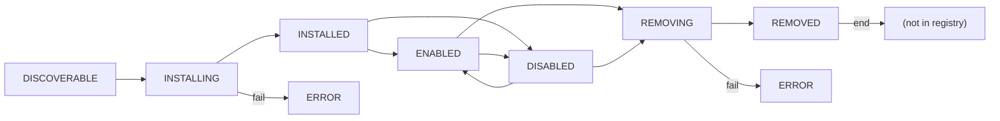
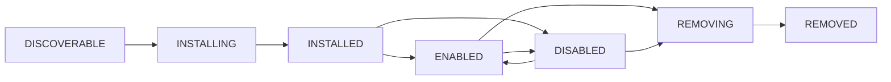
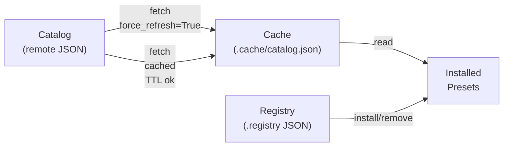

# State Machines — Specify CLI

**Generated**: 2026-05-18 (Detective)  
**Project**: spec-kit

---

## 1. Workflow Step Status Machine

**Entity**: `StepStatus` (enum in `src/specify_cli/workflows/base.py`)

**Valid States**:
- `PENDING` — Step waiting to execute
- `RUNNING` — Step currently executing
- `COMPLETED` — Step finished successfully
- `FAILED` — Step encountered error
- `SKIPPED` — Step was conditionally skipped (if/then branching)
- `PAUSED` — Step waiting for external signal to resume

**Transitions**:



**Triggers**:
- `PENDING → RUNNING`: Engine dequeues step for execution
- `RUNNING → COMPLETED`: Step handler returns `StepResult(status=COMPLETED, ...)`
- `RUNNING → FAILED`: Step handler returns `StepResult(status=FAILED, error=...)`
- `RUNNING → SKIPPED`: Control-flow step (if/then) evaluates condition to false
- `RUNNING → PAUSED`: Step handler returns `StepResult(status=PAUSED, ...)` (requires external resume signal)
- `PAUSED → RUNNING`: External signal (webhook, signal handler, etc.) resumes execution

**Confidence**: 🟢 (enum values directly from code)

**Implementation**: `StepResult.status` field, checked by `WorkflowEngine` to dispatch next action.

---

## 2. Workflow Run Status Machine

**Entity**: `RunStatus` (enum in `src/specify_cli/workflows/base.py`)

**Valid States**:
- `CREATED` — Run instantiated, not yet started
- `RUNNING` — Run currently executing steps
- `PAUSED` — Run suspended (all steps paused or waiting)
- `COMPLETED` — Run finished with all steps completed
- `FAILED` — Run terminated due to step failure or uncaught exception
- `ABORTED` — Run cancelled by user or system signal

**Transitions**:



**Triggers**:
- `CREATED → RUNNING`: Workflow engine starts execution
- `RUNNING → PAUSED`: Any step reaches `PAUSED`; entire run blocks
- `RUNNING → COMPLETED`: All steps reach `COMPLETED`
- `RUNNING → FAILED`: Any step reaches `FAILED` and error is not handled (no retry/fallback)
- `RUNNING → ABORTED`: User cancels (Ctrl+C), or system signal (SIGTERM)
- `PAUSED → RUNNING`: User/external system resumes all paused steps
- `PAUSED → ABORTED`: User cancels while paused

**Confidence**: 🟡 (enum values from code, but resume/abort triggering mechanism not fully visible in analyzed modules)

**Implementation**: `StepContext.run_id` + `RunStatus` tracking in workflow engine (not analyzed in detail here; see `src/specify_cli/workflows/engine.py`).

---

## 3. Preset Installation Lifecycle

**Entity**: Preset (across `PresetManifest`, `PresetRegistry`, `PresetManager`)

**Implicit States** (reconstructed from code flow):
- `DISCOVERABLE` — Present in catalog, not yet installed
- `INSTALLING` — Installation in progress (manifest validated, compatibility checked, being copied)
- `INSTALLED` — In registry, files in `.specify/presets/{id}`, manifest cached
- `ENABLED` — Installed and active in template resolution (default on install)
- `DISABLED` — Installed but skipped during template resolution
- `REMOVING` — Uninstall in progress
- `REMOVED` — Deleted from disk and registry

**Transitions**:



**Triggers**:
- `DISCOVERABLE → INSTALLING`: User runs `speckit preset install <id>`
- `INSTALLING → INSTALLED`: Manifest valid, compatibility OK, files copied, registry updated
- `INSTALLED → ENABLED`: Default state after install (registry entry created with enabled=true)
- `ENABLED → DISABLED`: User runs `speckit preset disable <id>` (registry toggled)
- `DISABLED → ENABLED`: User runs `speckit preset enable <id>`
- `(ENABLED|DISABLED) → REMOVING`: User runs `speckit preset remove <id>`
- `REMOVING → REMOVED`: Command files unregistered, directory deleted, registry cleared

**Key Data**:
- `registry.presets[id].installed_at` — Installation timestamp (preserved on update)
- `registry.presets[id].version` — Semantic version
- `registry.presets[id].priority` — Resolution priority (lower = higher)
- `registry.presets[id].enabled` — Boolean flag (controls template resolver inclusion)

**Confidence**: 🟡 (state flow inferred from method sequences; no explicit state machine in code)

---

## 4. Extension Installation Lifecycle

**Entity**: Extension (across `ExtensionManifest`, `ExtensionRegistry`, `ExtensionManager`)

**Implicit States** (parallel to Preset):
- `DISCOVERABLE` — In catalog
- `INSTALLING` — Being validated and installed
- `INSTALLED` — Files in `.specify/extensions/{id}`, manifest cached, commands registered
- `ENABLED` — Commands available in CLI
- `DISABLED` — Commands hidden
- `REMOVING` — Being uninstalled
- `REMOVED` — Deleted from disk and registry

**Transitions**:



**Trigger Details**:
- **Install**: `ExtensionManager.install()` validates manifest, checks compatibility, copies files, registers commands with agents
- **Enable/Disable**: Registry toggle; affects `CommandRegistrar` visibility
- **Remove**: `ExtensionManager.remove()` unregisters commands, deletes files, clears registry

**Key Commands**:
- Commands are registered in agent directories via `CommandRegistrar.register_commands(manifest, ext_dir)`
- Manifest-defined commands override core commands (if names match)
- Command format depends on agent type (Markdown for Claude, YAML for other formats)

**Confidence**: 🟡 (same inference pattern as Preset lifecycle)

---

## 5. Catalog & Registry Synchronization

**Implicit State**:



**Cache Invalidation**:
- **TTL**: 1 hour (preset catalogs are more volatile than extensions at 24h)
- **Force refresh**: `PresetCatalog.fetch_catalog(force_refresh=True)` bypasses TTL
- **Manual clear**: `PresetCatalog.clear_cache()` deletes `.cache/catalog-metadata.json` and catalog file

**Multi-Catalog Merge** (if multiple catalogs enabled in `.specify/preset-catalogs.yml`):
1. Iterate enabled catalogs in priority order
2. Fetch each (use cache if valid)
3. Merge: first preset ID wins (no overwrite of existing key)
4. Annotate each entry with `_catalog_name` and `_install_allowed` flags

**Confidence**: 🟢 (TTL and merge logic directly in `PresetCatalog._fetch_single_catalog()`)

---

## 6. Template Resolution Priority Stack

**Not a state machine, but a deterministic priority lookup**:

### Priority Levels (1=highest):

1. **Project Overrides** — `.specify/templates/overrides/{template_name}.{ext}`
2. **Installed Presets** — `.specify/presets/` (sorted by priority; lower = higher precedence)
3. **Extension Templates** — `.specify/extensions/{ext_id}/templates/` (sorted by priority)
4. **Core Templates** — `.specify/templates/` (built-in)

### Resolution Algorithm (Pseudo-code):

```
resolve(template_name, template_type, skip_presets=False):
  for level in [OVERRIDES, (PRESETS if !skip_presets), EXTENSIONS, CORE]:
    for entry in level.sorted_by_priority():
      if exists(entry / template_name):
        return path
  return None
```

**Confidence**: 🟢 (implemented in `PresetResolver.resolve()`)

---

## 7. Integration & Agent Selection

**State-like behavior** (stateless selection logic):

```
Step declares:
  - integration: "claude" (or null → use default)
  - model: "claude-opus-4-7" (or null → use default)

StepContext provides:
  - default_integration: str
  - default_model: str

Integration Runtime resolves:
  1. Use step.integration if declared
  2. Fallback to context.default_integration
  3. Error if neither set

Same for model
```

**Supported Integrations** (from `INTEGRATION_REGISTRY`):
- claude, copilot, cursor, windsurf, devin, codebuddy, codex, opencode, agy, amp, bob, forge, gemini, junie, kilocode, kimi, kiro-cli, lingma, pi, qodercli, qwen, roo, shai, tabnine, trae, vibe, auggie, codebuddy, generic

**Confidence**: 🟡 (list from code, but selection logic not fully analyzed)

---

## 8. Authentication State (Implicit)

**No explicit state machine, but request-level decision**:

```
HTTP Request to host H:
  1. Load auth.json (or use cached entries)
  2. Match H against registered host patterns (fnmatch)
  3. If match found:
       → Resolve provider & auth scheme
       → Call AuthProvider.resolve_token(entry)
       → Build auth headers via AuthProvider.auth_headers(token, scheme)
       → Add to request
  4. Else:
       → Send unauthenticated
```

**Provider State** (implicit):
- **token**: Direct token value
- **token_env**: Environment variable name (checked at request time)
- **azure-ad**: Service principal (tenant_id, client_id, client_secret_env)
- **azure-cli**: Acquired dynamically via `azure-cli` command (not tokens)

**Confidence**: 🟢 (opt-in model and host pattern matching from code; token resolution from `AuthProvider.resolve_token()`)

---

## Summary Table

| Entity | States | Deterministic | Confidence |
|--------|--------|---------------|-----------|
| StepStatus | 6 (PENDING, RUNNING, COMPLETED, FAILED, SKIPPED, PAUSED) | Yes | 🟢 |
| RunStatus | 6 (CREATED, RUNNING, PAUSED, COMPLETED, FAILED, ABORTED) | Yes | 🟡 |
| Preset Lifecycle | 7 (DISCOVERABLE → INSTALLING → INSTALLED → ENABLED/DISABLED → REMOVING → REMOVED) | Mostly | 🟡 |
| Extension Lifecycle | 7 (same as Preset) | Mostly | 🟡 |
| Template Resolution | Deterministic priority lookup (4 levels) | Yes | 🟢 |
| Authentication | Stateless host→provider matching + opt-in | Yes | 🟢 |
| Catalog Cache | TTL-based with force-refresh override | Yes | 🟢 |
