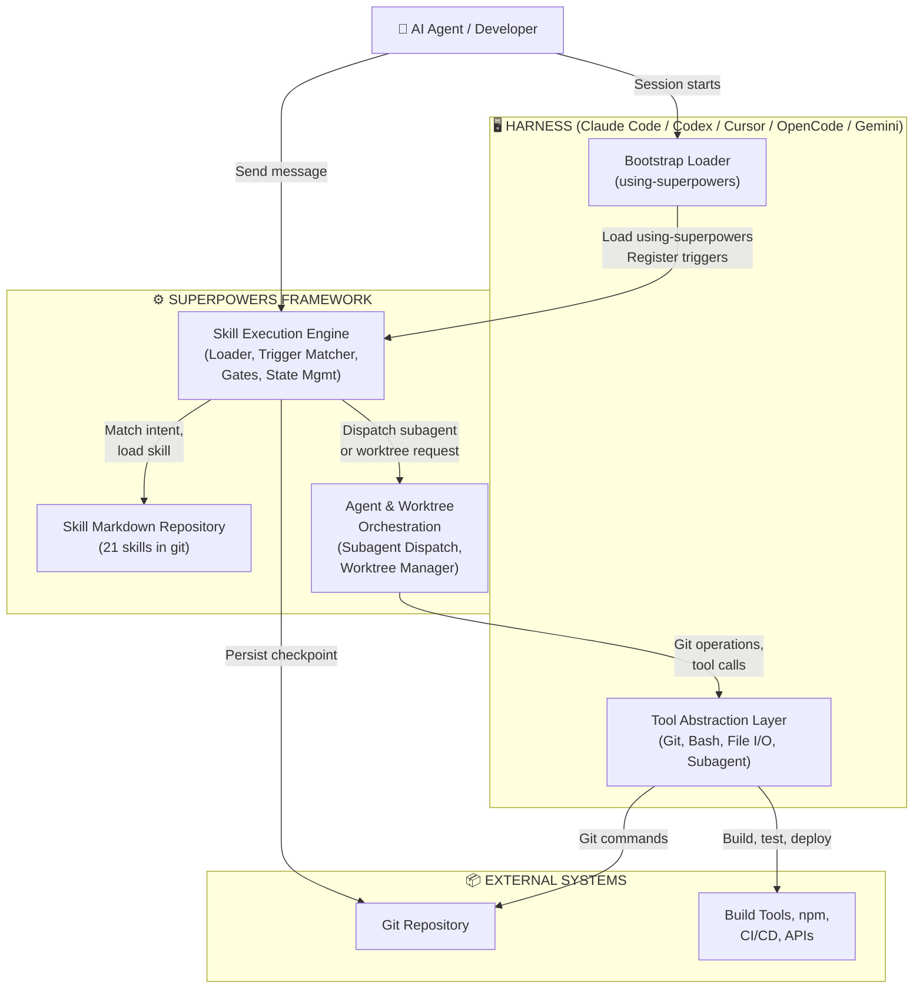

# Superpowers — C4 Containers Diagram (Level 2)

> **Project:** Superpowers  
> **Generated by:** Architect  
> **Date:** 2026-05-17  
> **Diagram Type:** C4 Level 2 — Container Architecture

---

## Container Overview



---

## Container Catalog

### 1. Bootstrap Loader

**Technology:** Markdown directive (using-superpowers) loaded by harness at session start

**Responsibility:**
- Define skill trigger rules (intent patterns → skill IDs)
- Register callbacks for auto-trigger mechanism
- Declare harness capabilities (tools available)
- Initialize session context

**Inputs:**
- Plugin manifest from harness (harness type, version, capabilities)
- User context (project directory, session ID)

**Outputs:**
- Trigger rules registered in agent context
- Bootstrap completion signal

**Example:**
```markdown
# Using Superpowers

## Triggers

- "let's make X" / "build X" → brainstorming
- "write code" → test-driven-development
- "test failed" / "error" → systematic-debugging
- "need review" → requesting-code-review
- "/skillname" → explicit override
```

---

### 2. Skill Markdown Repository

**Technology:** Git repository (local or remote), Markdown files with JSON frontmatter

**Responsibility:**
- Store all 21 skills as versioned Markdown documents
- Provide skill metadata (triggers, description, category)
- Maintain skill history (git blame for audit)
- Support multi-harness distribution (symlinks or copies)

**Structure:**
```
skills/
├── brainstorming/
│   ├── SKILL.md (metadata + 9-step workflow)
│   ├── examples/
│   └── templates/
├── test-driven-development/
│   ├── SKILL.md (RED-GREEN-REFACTOR cycle)
│   ├── anti-patterns.md
│   └── rationalizations.md
├── systematic-debugging/
├── writing-plans/
├── caveman/
├── caveman-commit/
├── caveman-review/
├── caveman-compress/
├── ... (15 more skills)
```

**Data Format (SKILL.md):**
```yaml
---
name: test-driven-development
description: "TDD cycle: RED-GREEN-REFACTOR"
triggers:
  - intent: write_code
  - keyword: implement
category: discipline
confidence: 🟢 CONFIRMED
version: 1.0
---

# Test-Driven Development

## Cycle

### RED Phase
... (Markdown workflow)
```

---

### 3. Skill Execution Engine

**Technology:** Agent reading Markdown in-context; logical state machines

**Responsibility:**
- Load skills from repository (Skill Loader)
- Match user intent to skill triggers (Trigger Matcher)
- Inject codebase context (Context Injector)
- Enforce hard gates & detect red flags (Gate Enforcer, Red Flag Detector)
- Manage workflow phases and checkpoints (State Manager)
- Render skill guidance to agent (Skill Renderer)

**Components:**

```
┌─────────────────────────────────────────┐
│    Skill Execution Engine               │
├─────────────────────────────────────────┤
│                                         │
│  ┌──────────────────────────────────┐  │
│  │ Skill Loader & Parser            │  │
│  │ ├─ Locate SKILL.md               │  │
│  │ ├─ Parse frontmatter             │  │
│  │ ├─ Load phases, gates, red flags │  │
│  │ └─ Return structured skill       │  │
│  └──────────────────────────────────┘  │
│                                         │
│  ┌──────────────────────────────────┐  │
│  │ Trigger Matcher                  │  │
│  │ ├─ Extract user intent           │  │
│  │ ├─ Match against rule set        │  │
│  │ ├─ Handle explicit /skill invoke │  │
│  │ └─ Return matched skill ID       │  │
│  └──────────────────────────────────┘  │
│                                         │
│  ┌──────────────────────────────────┐  │
│  │ Context Injector                 │  │
│  │ ├─ Codebase: files, commits      │  │
│  │ ├─ Session: branch, test status  │  │
│  │ ├─ User: preferences, harness    │  │
│  │ └─ Task: plan, checkpoint state  │  │
│  └──────────────────────────────────┘  │
│                                         │
│  ┌──────────────────────────────────┐  │
│  │ Gate Enforcer                    │  │
│  │ ├─ Hard gates: TDD RED, design   │  │
│  │ ├─ Check gate preconditions      │  │
│  │ ├─ Ask for consent if violated   │  │
│  │ └─ Log override decision         │  │
│  └──────────────────────────────────┘  │
│                                         │
│  ┌──────────────────────────────────┐  │
│  │ Red Flag Detector                │  │
│  │ ├─ Monitor agent behavior        │  │
│  │ ├─ Match against anti-patterns   │  │
│  │ ├─ Show rationalizations table   │  │
│  │ └─ Ask: intentional?             │  │
│  └──────────────────────────────────┘  │
│                                         │
│  ┌──────────────────────────────────┐  │
│  │ Skill Renderer                   │  │
│  │ ├─ Format workflow for readability  │
│  │ ├─ Highlight current phase       │  │
│  │ ├─ Emphasize relevant examples   │  │
│  │ └─ Show gates for phase          │  │
│  └──────────────────────────────────┘  │
│                                         │
│  ┌──────────────────────────────────┐  │
│  │ Checkpoint Saver                 │  │
│  │ ├─ Persist session state         │  │
│  │ ├─ Record completed skills       │  │
│  │ ├─ Save phase, decisions         │  │
│  │ └─ Enable resume in new session  │  │
│  └──────────────────────────────────┘  │
│                                         │
└─────────────────────────────────────────┘
```

**State Transitions:**

```
IDLE (bootstrap loaded)
  ↓ [user message]
INTENT_DETECTION → Extract intent from message
  ↓ [intent extracted]
TRIGGER_MATCH → Match against trigger rules
  ↓ [skill matched]
SKILL_LOAD → Load SKILL.md from repository
  ↓ [skill loaded]
CONTEXT_INJECT → Inject codebase, session, user context
  ↓ [context ready]
GATE_CHECK → Enforce hard gates if applicable
  ├─ Gate OK: proceed
  └─ Gate violated: ask for consent
  ↓ [gate passed or overridden]
RED_FLAG_CHECK → Monitor behavior against anti-patterns
  ├─ No violation: continue
  └─ Violation: show rationalization, ask to confirm
  ↓ [confirmed or corrected]
SKILL_RENDER → Present workflow to agent
  ↓ [agent reads skill]
PHASE_EXECUTE → Agent executes current phase
  ├─ Request tools (git, bash, file I/O)
  └─ Detect phase completion
  ↓ [phase done]
CHECKPOINT_SAVE → Persist phase completion, decisions
  ↓ [checkpoint saved]
PHASE_ADVANCE → Move to next phase or next skill
  ├─ Continue current skill
  ├─ Invoke next skill (if workflow defined)
  └─ Return to IDLE
```

**Hard Gates Enforced:**

| Gate | Trigger State | Action |
|------|---|---|
| **TDD RED** | Implementing feature | "No production code before failing test" |
| **Brainstorming Design** | After design written | "No implementation until design approved" |
| **Debugging Fix #3** | After 3rd fix attempt | "Escalate to human (architectural issue)" |

---

### 4. Agent & Worktree Orchestration

**Technology:** Subagent spawning (harness API), Git worktree management (native or `git worktree` fallback)

**Responsibility:**
- Dispatch subagents (implementer, reviewer)
- Manage git worktrees (create, detect, cleanup)
- Coordinate parallel/sequential task execution
- Handle environment detection (GIT_DIR vs GIT_COMMON)

**Subagent Dispatch Workflow:**

```
Subagent-Driven Development:
  For each task:
    1. Dispatch Implementer subagent
       ├─ Provide: full task text, codebase context
       ├─ Agent implements, tests, commits
       └─ Wait for spec review
       
    2. Dispatch Spec Reviewer subagent
       ├─ Confirm: code matches spec?
       ├─ No → Implementer fixes → re-review
       └─ Yes → proceed to step 3
       
    3. Dispatch Quality Reviewer subagent
       ├─ Approve: code quality?
       ├─ No → Implementer fixes → re-review
       └─ Yes → mark task complete ✅

State per task:
  - PENDING: waiting for implementer
  - IMPLEMENTING: agent coding
  - SPEC_REVIEW: waiting for reviewer
  - QUALITY_REVIEW: waiting for quality gate
  - DONE: task complete, merged/committed
```

**Worktree Isolation:**

```
Environment Detection:
  ├─ Check GIT_DIR == GIT_COMMON?
  │   ├─ Yes: normal repo, can create worktree
  │   └─ No: already in linked worktree, skip creation
  ├─ Check for existing branch?
  │   ├─ Yes: use existing isolation
  │   └─ No: create new worktree
  
Worktree Creation (priority):
  1. Native tool if available (Claude Code EnterWorktree, Codex UI)
  2. Git worktree fallback: git worktree add
  
Directory selection (priority):
  1. Explicit instruction
  2. .worktrees/ (project-local)
  3. worktrees/ (alternative)
  4. ~/.config/superpowers/worktrees/ (legacy)
  5. .worktrees/ (default, lowest)
  
Cleanup (post-execution):
  ├─ Detect ownership: created by Superpowers?
  │   ├─ Yes: git worktree remove (unless user requests keep)
  │   └─ No: don't touch (user managed)
```

---

### 5. Tool Abstraction Layer

**Technology:** Harness-native APIs (Claude Code, Codex, Cursor, etc.)

**Responsibility:**
- Abstract platform differences
- Provide unified tool interface
- Map generic actions to harness-specific tools
- Handle async operations, error recovery

**Tools Provided:**

| Generic Action | Claude Code | Codex CLI | Codex App | Cursor | OpenCode |
|---|---|---|---|---|---|
| run_code | `Bash` | Native runner | Native runner | IDE CLI | Native CLI |
| git_command | `Bash` with git | Native git | Native git | Native git | Native CLI |
| file_read | `Read` | File API | File UI | IDE API | File CLI |
| file_write | `Write` | File API | File UI | IDE API | File CLI |
| enter_worktree | `EnterWorktree` | `git worktree add` | Native UI | Git CLI | `git worktree add` |
| spawn_agent | `Agent` | Agent API | Native creation | Extension API | Subagent CLI |

---

### 6. Evaluation & Drill Framework

**Technology:** Test cases in `evals/` directory, harness-agnostic execution

**Responsibility:**
- Define skill behavior tests (before/after eval cases)
- Run behavior drills across multiple scenarios
- Measure effectiveness of skill changes
- Maintain eval history tied to git commits

**Example Eval Structure:**
```
evals/
├── tdd/
│   ├── red-phase-enforcement/
│   │   ├── prompt.md (setup)
│   │   ├── expected-behavior.md (what agent should do)
│   │   ├── success-criteria.md (measurements)
│   │   └── results/ (timestamped outcomes)
│   ├── green-phase-minimal-code/
│   └── ...
├── brainstorming/
│   ├── design-gate-enforcement/
│   └── ...
└── debugging/
    ├── root-cause-focus/
    ├── escalation-after-3-fails/
    └── ...
```

**Drill Execution:**
```
For each eval case:
  1. Setup: Create fresh project, set constraints
  2. Prompt: Send exact user message
  3. Monitor: Watch agent behavior, log actions
  4. Measure: Count gate violations, red flag triggers, correct behaviors
  5. Score: Against expected-behavior.md
  6. Report: Timestamped results with diff from baseline
```

---

### 7. Plugin Manifests

**Technology:** JSON/YAML config per harness

**Responsibility:**
- Declare plugin entry points
- Register skill locations
- Define bootstrap path
- Specify tool requirements

**Examples:**

**Claude Code (.claude-plugin/plugin.json):**
```json
{
  "name": "superpowers",
  "version": "5.1.0",
  "description": "AI agent behavior-shaping framework",
  "bootstrap": "using-superpowers",
  "skillsPath": [".claude/skills/", ".agents/skills/"],
  "requiredTools": ["Bash", "Read", "Write", "Edit", "Agent", "Glob", "Grep"]
}
```

**Codex (.codex-plugin/plugin.json):**
```json
{
  "name": "superpowers",
  "entry": "using-superpowers",
  "skillsDirectory": ".codex/skills/",
  "harness": "codex"
}
```

**Gemini (gemini-extension.json):**
```json
{
  "name": "superpowers",
  "cli_entry": "using-superpowers",
  "skills_path": "./skills/"
}
```

---

## Container Interactions

### Sequence: Brainstorming Flow

```mermaid
sequenceDiagram
    participant User
    participant Bootstrap
    participant Engine as Skill Engine
    participant Repo as Skill Repo
    participant Orchestration as Orchestration
    participant Tools as Tool Layer
    participant Git as Git
    
    User->>Bootstrap: "Let's build a feature"
    Bootstrap->>Engine: Detect intent → brainstorming
    Engine->>Repo: Load brainstorming/SKILL.md
    Repo-->>Engine: Skill content + metadata
    Engine->>Engine: Inject codebase context
    Engine->>User: Render 9-step design workflow
    
    User->>Engine: Execute steps 1-6 (design, write spec)
    Engine->>Engine: Gate check: design approved?
    Engine->>Engine: Checkpoint: design phase done
    Engine->>Tools: Save checkpoint
    Tools->>Git: Commit checkpoint
    
    Engine->>Repo: Load writing-plans/SKILL.md
    Repo-->>Engine: Plan skill
    User->>Engine: Execute plan generation
    Engine->>Orchestration: Ready for execution choice
    
    User->>Orchestration: Choose SDD (subagent-driven)
    Orchestration->>Tools: Create worktree (git worktree add)
    Tools->>Git: worktree created
    
    Orchestration->>Tools: Spawn Implementer subagent
    Tools-->>Orchestration: Agent ID
    Orchestration->>Tools: Spawn Spec Reviewer subagent
    (review loop...)
    
    Orchestration->>Tools: Save checkpoint
    Tools->>Git: Final commit, checkpoint
    Engine->>User: Execution complete
```

---

## Container Dependencies & Constraints

### Coupling Analysis

| Container | Depends On | Criticality | Rationale |
|-----------|---|---|---|
| Bootstrap Loader | Harness | 🔴 Critical | Must load at session start; no workaround |
| Skill Engine | Skill Repo | 🔴 Critical | Cannot function without skills |
| Skill Engine | Tool Layer | 🟡 High | Needs tools for execution, but graceful degradation possible |
| Orchestration | Skill Engine | 🟡 High | Dispatches per skill phase completion |
| Tool Layer | Harness APIs | 🔴 Critical | Platform-specific; no generic solution |
| Eval Framework | Skill Repo | 🟡 High | Measures skill behavior; not required for runtime |

### Failure Scenarios

| Failure | Impact | Recovery |
|---------|--------|---|
| **Skill Repo unavailable** | Cannot load skills → Skill Engine stalled | Fallback to cached skills (if available) or manual guidance |
| **Tool Layer unavailable** | Cannot execute git, bash, file ops | Agent cannot proceed; manual execution required |
| **Worktree creation fails** | Cannot isolate workspace | Warn user, proceed in main branch (risky) |
| **Subagent spawn fails** | Cannot parallelize tasks | Fallback to sequential execution |
| **Gate enforcement fails** | Soft constraint violated | Log violation, ask user for explicit consent |

---

**End of C4 Containers Diagram**
