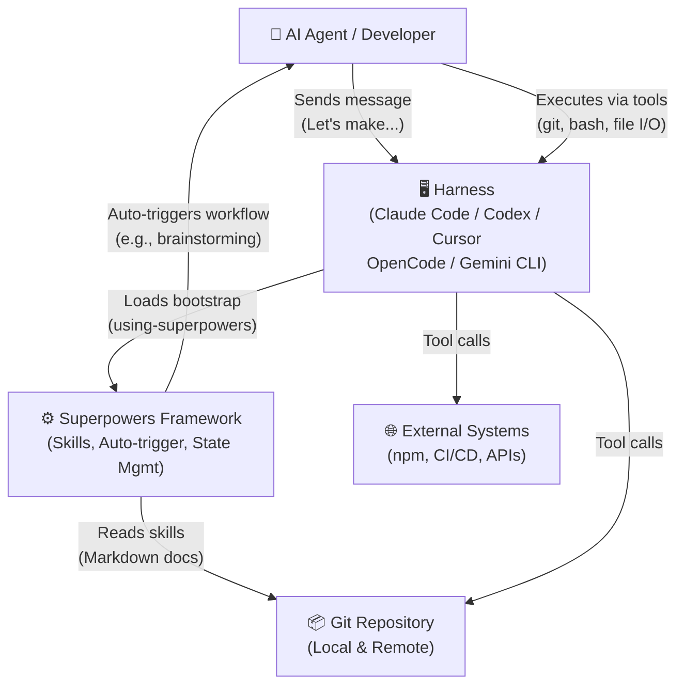

# Superpowers — C4 Context Diagram (Level 1)

> **Project:** Superpowers  
> **Generated by:** Architect  
> **Date:** 2026-05-17  
> **Diagram Type:** C4 Level 1 — System Context

---

## System Context Overview



### Actors & Responsibilities

| Actor | Role | Inputs | Outputs |
|-------|------|--------|---------|
| **User (AI Agent)** | Runs within harness; reads skills; executes workflows | Message intent, user requests, code context | Code changes, commits, PRs, design docs |
| **Harness** | IDE/CLI providing tools & bootstrap; manages session | Plugin manifests, tool invocations | Skill content, session context, tool results |
| **Superpowers** | Skill framework; triggers, gates, state management | User intent, codebase context | Skill workflows, checkpoints, guidance |
| **Git Repository** | Version control; stores skills & project code | Commands, commits, branches | Commit history, diffs, file content |
| **External Systems** | Build tools, package managers, CI/CD, APIs | Requests (build, test, publish) | Build results, test outcomes, deployment status |

---

## System Scope

### What's Included ✅

1. **Skill Loading & Execution**
   - 21 reusable workflows (brainstorming, TDD, debugging, planning, etc.)
   - Auto-trigger based on user intent
   - Context injection (codebase state, session history)

2. **Process Enforcement**
   - Hard gates (TDD RED, design approval, debugging escalation)
   - Red flag detection (anti-patterns)
   - Gate violation override with human consent

3. **State & Checkpoint Management**
   - Session checkpoint persistence
   - Workflow phase tracking
   - Cross-session resumability

4. **Agent Orchestration**
   - Subagent dispatch (per-task implementation + review)
   - Worktree isolation (git worktree management)
   - Parallel task execution support

### What's Excluded ❌

1. **Code Execution** (delegated to harness)
   - Running tests, builds, deployments
   - Harness tools (git, bash, file I/O) handle these

2. **Persistent Storage** (delegated to harness or Git)
   - User authentication, account management
   - Session database (file-based checkpoints only)

3. **LLM Model Management** (delegated to harness)
   - Model selection, version control
   - Prompt caching, context window optimization

---

## Data Flow Scenarios

### Scenario 1: Brainstorming → Implementation

```
1. User: "Let's build a user dashboard"
   ↓ [Harness receives message]
2. Bootstrap matches trigger: "let's build" → intent="design"
   ↓ [Superpowers loads brainstorming skill]
3. User reads 9-step design workflow
   - Explore project context (reads files, commits)
   - Ask clarifying questions
   - Propose 2-3 approaches
   - Write design doc to docs/superpowers/specs/YYYY-MM-DD-dashboard-design.md
   - Self-review, user approval (HARD GATE)
   ↓ [Gate passed, checkpoint saved]
4. Skill invokes writing-plans
   - Generate bite-sized implementation tasks
   - Output: plan.md with estimates and dependencies
   ↓
5. User chooses execution: subagent-driven or executing-plans
   - Isolation: enter worktree (via harness worktree tool)
   - Execute tasks sequentially or parallel
   - For each task: implement → verify → review
   ↓
6. Finished: merge to main, push, or keep branch
   - Verify tests pass
   - Harness detects finish intent
   - finishing-a-development-branch skill offers options: merge / PR / keep / discard
```

### Scenario 2: Test Failure → Systematic Debugging

```
1. User: "Tests failed, need to debug"
   ↓ [Harness detects error/failure]
2. Bootstrap triggers: "error" / "test failed" → systematic-debugging
   ↓ [Superpowers loads debugging skill]
3. User reads 4-phase debugging process
   - Phase 1: Gather evidence (error message, recent changes, data flow)
   - Phase 2: Find working pattern in codebase
   - Phase 3: Form hypothesis, test with one variable
   - Phase 4: Implement root-cause fix, verify
   ↓
4. User implements TDD cycle per skill:
   - RED: Write failing test
   - GREEN: Minimal code to pass
   - REFACTOR: Clean up
   ↓
5. Verification:
   - Test passes? Check for regressions
   - If fix #3+ fails: escalate to human (architectural issue signal)
   ↓ [Checkpoint saved with phase completed]
```

### Scenario 3: Code Review Request

```
1. User: "I need a code review"
   ↓
2. Bootstrap triggers: requesting-code-review
   ↓ [Superpowers loads skill]
3. Skill spawns external reviewer (subagent)
   - Reviewer reads code, spec, recent commits
   - Provides feedback (caveman-compressed review format)
   - 1-line feedback per issue: location, problem, fix
   ↓
4. User receives feedback, addresses items
   - Each item: verify, implement, test, commit
   ↓
5. Re-review until approved ✅
   ↓ [Checkpoint saved, task marked complete]
```

---

## Integration Patterns

### Bootstrap Auto-Trigger (Critical Contract)

```
Session Start:
  ├─ Harness loads: plugin.json
  ├─ Executes: using-superpowers bootstrap
  │  └─ Registers skill trigger rules
  │
At User Message:
  ├─ Extract intent (semantic, not keyword)
  ├─ Match against trigger rules:
  │  "let's make X" → brainstorming
  │  "write code" / "implement" → test-driven-development
  │  "test failed" → systematic-debugging
  │  "need review" → requesting-code-review
  │  "/skillname" → explicit override (highest priority)
  │
  └─ Load matched skill from git repo
```

**Note:** Real integration auto-triggers. Manual copying files, wrapping with `npx skills`, or requiring user opt-in = NOT a real integration (rejected in PR review).

### Harness Contracts

```
What Harness Must Provide:
├─ Tool Abstractions:
│  ├─ Git tool (status, commit, branch, worktree, push, pull)
│  ├─ Bash tool (npm, build, test, arbitrary commands)
│  ├─ File I/O (Read, Write, Edit, Glob, Grep)
│  └─ Subagent tool (spawn agents with context)
│
├─ Bootstrap Loading:
│  └─ Auto-load using-superpowers at session start
│
├─ Skill Access:
│  └─ Read .claude/skills/ or .agents/skills/ or harness-specific path
│
└─ Session Lifecycle:
   ├─ Provide session ID, harness name, user context
   └─ Support checkpoint persistence (project-local file storage)
```

---

## External Dependencies & Constraints

### Zero-Dependency Principle

Superpowers core adds **zero** external npm packages, language runtimes, or third-party services.

- Skills are pure Markdown
- Process enforcement via documentation
- No build step, no compilation

**Exception:** Support for new harnesses is acceptable if it uses platform-native capabilities, not external tools.

### Harness Compatibility

| Harness | Status | Plugin Type | Bootstrap | Tool Support |
|---------|--------|---|---|---|
| Claude Code | ✅ Implemented | `.claude-plugin/plugin.json` | Auto-load | Full |
| Codex CLI | ✅ Implemented | `.codex-plugin/plugin.json` | Auto-load | Full |
| Codex App | ✅ Implemented | `.codex-plugin/plugin.json` (shared) | Auto-load | Native worktree mgmt |
| Cursor IDE | ✅ Implemented | `.cursor-plugin/` | Via extension config | Full |
| OpenCode | ✅ Implemented | `.opencode/` | Config-based | Full |
| Gemini CLI | ✅ Implemented | `gemini-extension.json` | CLI invocation | Full |
| Factory Droid | ✅ Referenced | Via .version-bump.json | Indirect | Tool-dependent |
| GitHub Copilot CLI | ✅ Referenced | Via .version-bump.json | Indirect | Tool-dependent |

---

## Quality & Governance

### PR Review Gates

Before merging any PR to Superpowers core:

1. **Real Problem Statement**
   - Not speculative, not theoretical
   - Describe actual user experience that broke

2. **Search Existing PRs**
   - Open AND closed
   - If duplicate exists, stop (don't re-submit)

3. **Complete PR Template**
   - Every section filled in with real, specific answers
   - No placeholders, no summaries

4. **Show Human Partner the Diff**
   - Before opening PR
   - Get explicit approval

5. **Core Constraints**
   - Zero-dependency (no new npm packages)
   - General-purpose (not domain/tool specific)
   - Evidence-based (skill changes need eval data)

### 94% Rejection Rate

Superpowers maintains high rejection rate as **intentional quality signal**:
- Slop PRs closed within hours
- Low-quality work does not waste maintainers' time
- Agents must read CLAUDE.md, understand project, show work before submitting

---

## Key Metrics & SLOs

### System Health

| Metric | Target | Measurement |
|--------|--------|---|
| Skill Auto-Trigger Accuracy | ≥95% | Intent match in evals |
| Hard Gate Violation Override Rate | <5% | Audited from checkpoints |
| Subagent Dispatch Success | ≥98% | PR merge rate on SDD tasks |
| Worktree Isolation Integrity | 100% | No nested worktree incidents |
| Zero External Deps | ✅ | npm audit clean, no runtime deps |

---

**End of C4 Context Diagram**
