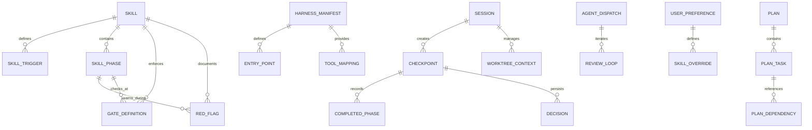

# Superpowers — Entity Relationship Diagram (ERD)

> **Project:** Superpowers  
> **Generated by:** Architect  
> **Date:** 2026-05-17  
> **Diagram Type:** Logical Data Model

---

## Full ERD in Mermaid



---

## Entity Definitions

### Core Entities

#### **SKILL**
Represents a reusable workflow document.

| Attribute | Type | Constraint | Description |
|-----------|------|-----------|---|
| `skill_id` | STRING | PK | Unique identifier (e.g., "test-driven-development") |
| `name` | STRING | NOT NULL | Human-readable name |
| `description` | STRING | NOT NULL | One-line summary |
| `category` | ENUM | NOT NULL | Communication, Workflow, Discipline, Review, Advanced |
| `version` | STRING | NOT NULL | Semantic version (e.g., "1.0.0") |
| `confidence` | ENUM | NOT NULL | 🟢 CONFIRMADO, 🟡 INFERIDO, 🔴 LACUNA |
| `file_path` | STRING | NOT NULL | Path to SKILL.md in repo |
| `created_at` | TIMESTAMP | NOT NULL | Creation date (from git commit) |
| `modified_at` | TIMESTAMP | NOT NULL | Last modification (from git) |
| `depends_on` | STRING[] | OPTIONAL | List of prerequisite skill_ids |

**Example:**
```json
{
  "skill_id": "test-driven-development",
  "name": "Test-Driven Development (TDD)",
  "description": "RED-GREEN-REFACTOR cycle with mandatory failing test first",
  "category": "Discipline",
  "version": "1.0.0",
  "confidence": "🟢 CONFIRMADO",
  "file_path": ".claude/skills/test-driven-development/SKILL.md"
}
```

---

#### **SKILL_TRIGGER**
Defines when a skill should be invoked.

| Attribute | Type | Constraint | Description |
|-----------|------|-----------|---|
| `trigger_id` | STRING | PK | Unique (e.g., "tdd-write-code") |
| `skill_id` | STRING | FK → SKILL | Which skill this triggers |
| `trigger_type` | ENUM | NOT NULL | INTENT, KEYWORD, EXPLICIT, EVENT |
| `pattern` | STRING | NOT NULL | Intent pattern or regex (e.g., "let's make") |
| `priority` | INT | NOT NULL | Order in matching (explicit=100, intent=50, keyword=10) |
| `confidence_threshold` | FLOAT | NOT NULL | Match score must exceed this (0.0-1.0) |
| `description` | STRING | NOT NULL | When/why this trigger fires |

**Example:**
```json
{
  "trigger_id": "brainstorm-make",
  "skill_id": "brainstorming",
  "trigger_type": "INTENT",
  "pattern": "let's make|build|create",
  "priority": 50,
  "confidence_threshold": 0.85,
  "description": "User wants to design before implementing"
}
```

---

#### **SKILL_PHASE**
A step/phase within a skill's workflow.

| Attribute | Type | Constraint | Description |
|-----------|------|-----------|---|
| `phase_id` | STRING | PK | Unique (e.g., "brainstorm-explore") |
| `skill_id` | STRING | FK → SKILL | Parent skill |
| `sequence_num` | INT | NOT NULL | Order (1, 2, 3, ...) |
| `name` | STRING | NOT NULL | Phase name (e.g., "Explore Context") |
| `description` | STRING | NOT NULL | What happens in this phase |
| `entry_condition` | STRING | OPTIONAL | Precondition (e.g., "design doc written") |
| `exit_condition` | STRING | OPTIONAL | Completion criteria (e.g., "user approved") |
| `expected_duration_mins` | INT | OPTIONAL | Estimated time |
| `artifacts_produced` | STRING[] | OPTIONAL | Files/outputs expected |

**Example:**
```json
{
  "phase_id": "brainstorm-user-review",
  "skill_id": "brainstorming",
  "sequence_num": 8,
  "name": "User Reviews Written Spec",
  "description": "Ask user to review spec and approve before proceeding to implementation",
  "entry_condition": "spec self-review complete",
  "exit_condition": "user approval OR user requests changes",
  "expected_duration_mins": 15,
  "artifacts_produced": ["approval_decision", "requested_changes[]"]
}
```

---

#### **GATE_DEFINITION**
Hard or soft gates that control phase advancement.

| Attribute | Type | Constraint | Description |
|-----------|------|-----------|---|
| `gate_id` | STRING | PK | Unique (e.g., "tdd-red-gate") |
| `skill_id` | STRING | FK → SKILL | Which skill enforces this |
| `phase_id` | STRING | FK → SKILL_PHASE | At which phase |
| `gate_type` | ENUM | NOT NULL | HARD (mandatory), SOFT (advisory) |
| `trigger_state` | STRING | NOT NULL | When to check (e.g., "code written") |
| `precondition` | STRING | NOT NULL | Guard condition (e.g., "test file exists") |
| `violation_message` | STRING | NOT NULL | What to show if violated |
| `recovery_action` | STRING | NOT NULL | What to offer (revert, confirm, escalate) |
| `requires_consent` | BOOLEAN | NOT NULL | HARD gates always true; SOFT gates false |

**Example (TDD RED Gate):**
```json
{
  "gate_id": "tdd-red-gate",
  "skill_id": "test-driven-development",
  "phase_id": "tdd-red",
  "gate_type": "HARD",
  "trigger_state": "code_written",
  "precondition": "production_code_exists",
  "violation_message": "Code before test detected. Iron law: delete & restart.",
  "recovery_action": "ask_consent or delete_code",
  "requires_consent": true
}
```

---

#### **RED_FLAG**
Anti-patterns that indicate violations of skill rules.

| Attribute | Type | Constraint | Description |
|-----------|------|-----------|---|
| `flag_id` | STRING | PK | Unique (e.g., "tdd-test-after") |
| `skill_id` | STRING | FK → SKILL | Which skill documents this |
| `phase_id` | STRING | FK → SKILL_PHASE | Relevant phase |
| `description` | STRING | NOT NULL | What the violation looks like |
| `severity` | ENUM | NOT NULL | HIGH, MEDIUM, LOW |
| `category` | ENUM | NOT NULL | PROCESS, ARCHITECTURE, TESTING, SAFETY |
| `rationalization` | STRING | NOT NULL | Common excuse agents make |
| `reality_check` | STRING | NOT NULL | Corrective explanation |
| `detection_keyword` | STRING[] | OPTIONAL | Keywords in agent text that trigger flag |

**Example:**
```json
{
  "flag_id": "tdd-test-after",
  "skill_id": "test-driven-development",
  "phase_id": "tdd-red",
  "description": "Agent says 'I'll test after'",
  "severity": "HIGH",
  "category": "PROCESS",
  "rationalization": "I'll test after it works",
  "reality_check": "Tests after = what does this do? Tests first = what should this do?",
  "detection_keyword": ["test after", "test later", "write tests"]
}
```

---

### Session & Checkpoint Entities

#### **SESSION**
Represents an agent session using Superpowers.

| Attribute | Type | Constraint | Description |
|-----------|------|-----------|---|
| `session_id` | STRING | PK | UUID or derived from harness |
| `harness_type` | ENUM | NOT NULL | claude-code, codex-cli, codex-app, cursor, opencode, gemini |
| `user_id` | STRING | OPTIONAL | User identifier (if tracked) |
| `created_at` | TIMESTAMP | NOT NULL | Session start |
| `ended_at` | TIMESTAMP | OPTIONAL | Session end (NULL if ongoing) |
| `current_skill_id` | STRING | FK → SKILL | Active skill (NULL if idle) |
| `current_phase_num` | INT | OPTIONAL | Current phase sequence |
| `status` | ENUM | NOT NULL | ACTIVE, PAUSED, COMPLETED, ABANDONED |
| `project_path` | STRING | NOT NULL | Root directory of project being worked on |
| `checkpoints_count` | INT | NOT NULL | Number of saved checkpoints |

**Example:**
```json
{
  "session_id": "sess-20260517-abc123",
  "harness_type": "claude-code",
  "created_at": "2026-05-17T10:00:00Z",
  "current_skill_id": "brainstorming",
  "current_phase_num": 6,
  "status": "ACTIVE",
  "project_path": "/Users/alice/myapp"
}
```

---

#### **CHECKPOINT**
Saved state at key workflow moments.

| Attribute | Type | Constraint | Description |
|-----------|------|-----------|---|
| `checkpoint_id` | STRING | PK | UUID |
| `session_id` | STRING | FK → SESSION | Which session |
| `timestamp` | TIMESTAMP | NOT NULL | When saved |
| `skill_id` | STRING | FK → SKILL | Current skill |
| `phase_num` | INT | OPTIONAL | Current phase (within skill) |
| `state_snapshot` | JSON | NOT NULL | Full session state (serialized) |
| `completed_skills` | STRING[] | NOT NULL | List of finished skill_ids |
| `pending_skills` | STRING[] | NOT NULL | List of next skills |
| `decisions_made` | JSON | NOT NULL | User choices (approach, tech stack, etc.) |
| `artifacts_generated` | STRING[] | NOT NULL | Files created (specs, plans, docs) |
| `gates_overridden` | JSON[] | NOT NULL | Hard gates bypassed (timestamp, gate_id, reason) |

**Example:**
```json
{
  "checkpoint_id": "cp-20260517-001",
  "session_id": "sess-20260517-abc123",
  "timestamp": "2026-05-17T11:30:00Z",
  "skill_id": "brainstorming",
  "phase_num": 8,
  "completed_skills": ["brainstorming"],
  "pending_skills": ["writing-plans", "test-driven-development"],
  "decisions_made": {
    "design_approach": "Component-driven with composition",
    "tech_stack": ["React", "TypeScript", "Node.js", "PostgreSQL"]
  },
  "artifacts_generated": ["docs/superpowers/specs/2026-05-17-dashboard-design.md"],
  "gates_overridden": []
}
```

---

#### **COMPLETED_PHASE**
Record of each phase completion in a checkpoint.

| Attribute | Type | Constraint | Description |
|-----------|------|-----------|---|
| `id` | STRING | PK | UUID |
| `checkpoint_id` | STRING | FK → CHECKPOINT | Parent checkpoint |
| `skill_id` | STRING | FK → SKILL | Which skill |
| `phase_id` | STRING | FK → SKILL_PHASE | Which phase |
| `completed_at` | TIMESTAMP | NOT NULL | When completed |
| `duration_secs` | INT | OPTIONAL | How long phase took |
| `output` | STRING | OPTIONAL | Phase result/summary |

---

#### **DECISION**
User or system choice recorded in checkpoint.

| Attribute | Type | Constraint | Description |
|-----------|------|-----------|---|
| `decision_id` | STRING | PK | UUID |
| `checkpoint_id` | STRING | FK → CHECKPOINT | Parent checkpoint |
| `category` | ENUM | NOT NULL | ARCHITECTURE, TECH_STACK, PROCESS, APPROVAL |
| `question` | STRING | NOT NULL | What was being decided |
| `choice` | STRING | NOT NULL | Selected option |
| `alternatives` | STRING[] | NOT NULL | Other options offered |
| `made_at` | TIMESTAMP | NOT NULL | When decided |

---

### Worktree & Environment Entities

#### **WORKTREE_CONTEXT**
Isolation environment state for a session.

| Attribute | Type | Constraint | Description |
|-----------|------|-----------|---|
| `context_id` | STRING | PK | UUID |
| `session_id` | STRING | FK → SESSION | Which session |
| `git_dir` | STRING | NOT NULL | GIT_DIR env var value |
| `git_common_dir` | STRING | NOT NULL | GIT_COMMON_DIR env var value |
| `is_linked_worktree` | BOOLEAN | NOT NULL | True if GIT_DIR != GIT_COMMON |
| `worktree_path` | STRING | OPTIONAL | Path to worktree (if created) |
| `branch_name` | STRING | OPTIONAL | Current branch name |
| `isolation_level` | ENUM | NOT NULL | NONE, WORKTREE, DETACHED |
| `created_by_superpowers` | BOOLEAN | NOT NULL | Should we clean it up? |
| `cleanup_strategy` | ENUM | NOT NULL | REMOVE, KEEP, ASK_USER |

**Example:**
```json
{
  "context_id": "wtc-20260517-001",
  "session_id": "sess-20260517-abc123",
  "is_linked_worktree": true,
  "worktree_path": ".worktrees/feature-user-profile",
  "branch_name": "feature/user-profile",
  "isolation_level": "WORKTREE",
  "created_by_superpowers": true,
  "cleanup_strategy": "ASK_USER"
}
```

---

### Planning & Execution Entities

#### **PLAN**
Implementation plan generated by writing-plans skill.

| Attribute | Type | Constraint | Description |
|-----------|------|-----------|---|
| `plan_id` | STRING | PK | UUID |
| `session_id` | STRING | FK → SESSION | Which session |
| `skill_id` | STRING | FK → SKILL | "writing-plans" |
| `title` | STRING | NOT NULL | Feature/component name |
| `goal` | STRING | NOT NULL | One-sentence goal |
| `architecture` | STRING | NOT NULL | 2-3 sentence approach |
| `tech_stack` | STRING[] | NOT NULL | Technologies used |
| `created_at` | TIMESTAMP | NOT NULL | When plan generated |
| `file_path` | STRING | NOT NULL | Path to plan.md |
| `total_tasks` | INT | NOT NULL | Number of tasks |
| `estimated_hours` | FLOAT | NOT NULL | Total estimated effort |

---

#### **PLAN_TASK**
Individual task within a plan.

| Attribute | Type | Constraint | Description |
|-----------|------|-----------|---|
| `task_id` | STRING | PK | UUID |
| `plan_id` | STRING | FK → PLAN | Parent plan |
| `sequence_num` | INT | NOT NULL | Order (1, 2, 3, ...) |
| `title` | STRING | NOT NULL | What to implement |
| `description` | STRING | NOT NULL | Detailed requirements |
| `status` | ENUM | NOT NULL | PENDING, IN_PROGRESS, DONE, BLOCKED |
| `estimated_hours` | FLOAT | NOT NULL | Estimated effort (max 2 hours) |
| `files_create` | STRING[] | NOT NULL | Exact file paths to create |
| `files_modify` | STRING[] | NOT NULL | Files to change (path:line-range) |
| `test_files` | STRING[] | NOT NULL | Test files affected |
| `depends_on` | STRING[] | OPTIONAL | Task IDs that must complete first |

---

#### **PLAN_DEPENDENCY**
Tracks task dependencies.

| Attribute | Type | Constraint | Description |
|-----------|------|-----------|---|
| `dep_id` | STRING | PK | UUID |
| `task_id` | STRING | FK → PLAN_TASK | Dependent task |
| `depends_on_task_id` | STRING | FK → PLAN_TASK | Required task |
| `dependency_type` | ENUM | NOT NULL | MUST_COMPLETE, SHOULD_COMPLETE, PARALLEL_OK |

---

### Agent Dispatch & Review Entities

#### **AGENT_DISPATCH**
Record of subagent spawning for a task.

| Attribute | Type | Constraint | Description |
|-----------|------|-----------|---|
| `dispatch_id` | STRING | PK | UUID |
| `session_id` | STRING | FK → SESSION | Which session |
| `task_id` | STRING | FK → PLAN_TASK | Which task |
| `agent_role` | ENUM | NOT NULL | IMPLEMENTER, SPEC_REVIEWER, QUALITY_REVIEWER |
| `agent_id` | STRING | NOT NULL | Spawned agent identifier |
| `dispatched_at` | TIMESTAMP | NOT NULL | When spawned |
| `completed_at` | TIMESTAMP | OPTIONAL | When finished |
| `status` | ENUM | NOT NULL | PENDING, RUNNING, DONE, FAILED |
| `output_summary` | STRING | OPTIONAL | Agent work summary |

---

#### **REVIEW_LOOP**
Iteration of code review for a task.

| Attribute | Type | Constraint | Description |
|-----------|------|-----------|---|
| `loop_id` | STRING | PK | UUID |
| `dispatch_id` | STRING | FK → AGENT_DISPATCH | Parent dispatch |
| `iteration_num` | INT | NOT NULL | Review round (1, 2, 3, ...) |
| `feedback` | STRING | NOT NULL | Reviewer feedback |
| `status` | ENUM | NOT NULL | APPROVED, CHANGES_REQUESTED |
| `reviewed_at` | TIMESTAMP | NOT NULL | When reviewed |

---

### Harness Integration Entities

#### **HARNESS_MANIFEST**
Configuration for each supported harness.

| Attribute | Type | Constraint | Description |
|-----------|------|-----------|---|
| `manifest_id` | STRING | PK | Harness type (claude-code, codex-cli, etc.) |
| `harness_name` | STRING | NOT NULL | Human-readable name |
| `harness_version` | STRING | OPTIONAL | Version (if versioned) |
| `bootstrap_path` | STRING | NOT NULL | Path to using-superpowers file |
| `skills_search_paths` | STRING[] | NOT NULL | Where to find SKILL.md files |
| `entry_point_path` | STRING | NOT NULL | Plugin manifest path |
| `supported_tools` | STRING[] | NOT NULL | Available tools (git, bash, file I/O, etc.) |
| `env_detection_rules` | JSON | NOT NULL | How to detect harness type & environment |

**Example:**
```json
{
  "manifest_id": "claude-code",
  "harness_name": "Claude Code CLI",
  "bootstrap_path": "using-superpowers",
  "skills_search_paths": [".claude/skills/", ".agents/skills/"],
  "entry_point_path": ".claude-plugin/plugin.json",
  "supported_tools": ["Bash", "Read", "Write", "Edit", "Agent", "Glob", "Grep"],
  "env_detection_rules": {
    "GIT_DIR_vs_COMMON": "detect worktree via GIT_DIR != GIT_COMMON_DIR"
  }
}
```

---

#### **ENTRY_POINT**
Skill invocation entry (bootstrap trigger or explicit).

| Attribute | Type | Constraint | Description |
|-----------|------|-----------|---|
| `entry_id` | STRING | PK | UUID |
| `manifest_id` | STRING | FK → HARNESS_MANIFEST | Which harness |
| `skill_id` | STRING | FK → SKILL | Which skill |
| `invocation_method` | ENUM | NOT NULL | TRIGGER, EXPLICIT, EVENT, COMMAND |
| `description` | STRING | NOT NULL | How this entry fires |

---

#### **TOOL_MAPPING**
Maps generic actions to harness-specific tools.

| Attribute | Type | Constraint | Description |
|-----------|------|-----------|---|
| `mapping_id` | STRING | PK | UUID |
| `manifest_id` | STRING | FK → HARNESS_MANIFEST | Which harness |
| `generic_action` | STRING | NOT NULL | run_code, git_command, file_read, etc. |
| `harness_tool_name` | STRING | NOT NULL | Claude Code "Bash" vs Codex "NativeRunner" |
| `parameters` | JSON | OPTIONAL | Tool-specific config |
| `timeout_ms` | INT | OPTIONAL | Max execution time |

---

### User Preferences

#### **USER_PREFERENCE**
User-specific skill overrides and settings.

| Attribute | Type | Constraint | Description |
|-----------|------|-----------|---|
| `pref_id` | STRING | PK | UUID |
| `user_id` | STRING | NOT NULL | User identifier |
| `harness_type` | ENUM | NOT NULL | Which harness this applies to |
| `skill_id` | STRING | FK → SKILL | Which skill (NULL = global) |
| `preference_key` | STRING | NOT NULL | Setting name (caveman_mode, gate_strictness, etc.) |
| `preference_value` | STRING | NOT NULL | Value (full, strict, relaxed, etc.) |
| `applied_from` | TIMESTAMP | NOT NULL | When preference took effect |

**Example:**
```json
{
  "pref_id": "uprefs-alice-001",
  "user_id": "alice@example.com",
  "harness_type": "claude-code",
  "skill_id": null,
  "preference_key": "caveman_mode",
  "preference_value": "full",
  "applied_from": "2026-05-01T00:00:00Z"
}
```

---

#### **SKILL_OVERRIDE**
Allow users to customize skill behavior.

| Attribute | Type | Constraint | Description |
|-----------|------|-----------|---|
| `override_id` | STRING | PK | UUID |
| `user_id` | STRING | NOT NULL | User |
| `skill_id` | STRING | FK → SKILL | Skill being customized |
| `override_type` | ENUM | NOT NULL | GATE_STRICTNESS, RED_FLAG_TOLERANCE, PHASE_SKIP |
| `original_value` | STRING | NOT NULL | Default from skill |
| `overridden_value` | STRING | NOT NULL | User's value |
| `reason` | STRING | OPTIONAL | Why user overrode |
| `effective_from` | TIMESTAMP | NOT NULL | When override applies |

---

## Relationship Descriptions

### 1:N Relationships

- **SKILL → SKILL_TRIGGER** (1:many)
  - One skill has multiple triggers (intent, keyword, explicit)
  - Example: brainstorming triggered by "let's make", "build", "create", "/brainstorm"

- **SKILL → SKILL_PHASE** (1:many)
  - One skill has sequential phases
  - Example: brainstorming has 9 phases

- **SKILL → GATE_DEFINITION** (1:many)
  - One skill enforces multiple gates
  - Example: TDD enforces RED gate, GREEN gate, REFACTOR gate

- **SKILL → RED_FLAG** (1:many)
  - One skill documents many anti-patterns
  - Example: TDD lists 12+ red flags

- **SKILL_PHASE → RED_FLAG** (1:many)
  - One phase has relevant red flags
  - Example: RED phase has flags like "test after", "code before test"

- **SESSION → CHECKPOINT** (1:many)
  - One session has multiple checkpoints (pauses)
  - Example: save after brainstorming, after plan, after task 1, etc.

- **SESSION → WORKTREE_CONTEXT** (1:1)
  - One session manages one worktree context (or none)

- **CHECKPOINT → COMPLETED_PHASE** (1:many)
  - One checkpoint records multiple phases completed in this session

- **PLAN → PLAN_TASK** (1:many)
  - One plan contains multiple tasks

- **PLAN_TASK → PLAN_DEPENDENCY** (1:many)
  - One task depends on zero-to-many other tasks

- **AGENT_DISPATCH → REVIEW_LOOP** (1:many)
  - One dispatch (task) has multiple review iterations (feedback → fix → re-review)

- **HARNESS_MANIFEST → ENTRY_POINT** (1:many)
  - One harness registers multiple skill entry points

- **HARNESS_MANIFEST → TOOL_MAPPING** (1:many)
  - One harness maps multiple generic actions to tools

---

## Key Constraints

### Business Rules (Enforced via Skill Gates)

1. **TDD Iron Law**
   - A SKILL_PHASE of type "RED" cannot be exited until RED_FLAG "code before test" is absent AND test fails

2. **Design Approval Gate**
   - brainstorming SKILL cannot advance past phase 7 (user review) without explicit user decision

3. **Debugging Escalation**
   - A PLAN_TASK cannot have 4+ AGENT_DISPATCH records with status FAILED in systematic-debugging context without human escalation

4. **Worktree Isolation**
   - If SESSION.current_skill_id involves code changes AND WORKTREE_CONTEXT.is_linked_worktree == false AND project has >100 files, system SHOULD offer worktree creation

### Data Integrity Constraints

- CHECKPOINT.completed_skills ⊆ SKILL.skill_id (valid skills only)
- CHECKPOINT.pending_skills ⊆ SKILL.skill_id (valid skills only)
- PLAN_TASK.estimated_hours ≤ 2.0 (max 2 hours per task)
- PLAN.total_tasks == COUNT(PLAN_TASK WHERE plan_id = PLAN.plan_id)
- SESSION.current_phase_num ≤ COUNT(SKILL_PHASE WHERE skill_id = SESSION.current_skill_id)

---

## Summary of Key Entities

| Entity | Purpose | Cardinality | Example |
|--------|---------|---|---|
| **SKILL** | Reusable workflow | 21 total | test-driven-development |
| **SKILL_TRIGGER** | When to invoke | ~50+ total | "let's make" → brainstorming |
| **SKILL_PHASE** | Step within skill | ~80 total | TDD RED phase |
| **GATE_DEFINITION** | Workflow control | ~15 total | TDD RED gate (hard) |
| **RED_FLAG** | Anti-patterns | ~100+ total | "I'll test after" |
| **SESSION** | Agent session | 1 per run | sess-20260517-abc |
| **CHECKPOINT** | Saved state | 3-5 per session | cp-20260517-001 |
| **PLAN** | Implementation | 1 per feature | plan-dashboard-2026-05-17 |
| **PLAN_TASK** | Bite-sized work | 5-15 per plan | Task 1: Create UserProfile component |
| **WORKTREE_CONTEXT** | Git isolation | 0-1 per session | wtc-20260517-001 |
| **AGENT_DISPATCH** | Subagent spawn | 3+ per task | dispatch for task 1 implementer |
| **HARNESS_MANIFEST** | Harness config | 6 supported | claude-code plugin config |

---

**End of Entity Relationship Diagram**
