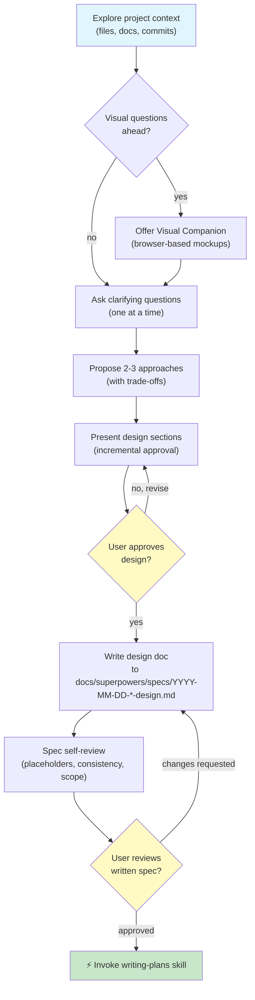

# Brainstorming Module — Flowchart

> **Module:** brainstorming  
> **Type:** Workflow  
> **Purpose:** Design before implementation. Prevent unexamined assumptions.  
> **Context:** 9-step collaborative dialogue to create validated design specs

---

## Flow Diagram

---

## Key Functions

### 1. Explore Project Context
- Check current files, documentation, recent commits
- Assess scope: flag oversized requests
- Determine if decomposition needed

**Entry Logic:** Start when brainstorming invoked  
**Exit Condition:** Context understood, ready for questions

---

### 2. Visual Companion Decision
- Determine if topic involves visual design (UI, mockups, layouts)
- If yes: Offer browser-based companion in separate message
- Companion shown ONLY for visual questions, not all questions

**Entry Logic:** After context exploration  
**Exit Condition:** Visual mode enabled (optional) OR skipped

---

### 3. Clarifying Questions Phase
- Ask ONE question per message
- Prefer multiple-choice when possible
- Focus on: purpose, constraints, success criteria
- Continue until design intent clear

**Entry Logic:** After visual companion (or skipped)  
**Exit Condition:** All key clarifications answered

---

### 4. Propose Approaches
- Present 2-3 different implementations
- Show trade-offs for each
- Lead with recommendation and reasoning
- Explain WHY you recommend one

**Entry Logic:** Questions complete  
**Exit Condition:** User accepts approach or requests revision

---

### 5. Present Design
- Scale sections to complexity (3 sentences to 300 words)
- Cover: architecture, components, data flow, error handling, testing
- Ask after EACH section for approval
- Be ready to go back and clarify

**Entry Logic:** Approach approved  
**Exit Condition:** All sections approved by user

---

### 6. Write Design Doc
- Save to `docs/superpowers/specs/YYYY-MM-DD-<topic>-design.md`
- Commit to git
- Ensure no TBD placeholders

**Entry Logic:** Design approved  
**Exit Condition:** Doc written, staged, committed

---

### 7. Spec Self-Review
- Scan for: placeholders, contradictions, ambiguity, scope issues
- Fix issues inline (no re-review needed)
- Ensure internal consistency

**Entry Logic:** Design doc written  
**Exit Condition:** All issues fixed

---

### 8. User Reviews Written Spec
- Ask user to review spec file before proceeding
- Gather feedback and change requests
- If changes: revise and re-run self-review loop

**Entry Logic:** Spec self-review passed  
**Exit Condition:** User approves spec OR requests changes

---

### 9. Invoke Writing-Plans
- HARD GATE: Never invoke other implementation skills
- ONLY next step is `writing-plans` skill
- Terminal state: workflow complete

**Entry Logic:** User approves spec  
**Exit Condition:** writing-plans skill invoked

---

## Anti-Patterns & Red Flags

| Pattern | Red Flag | Consequence | Fix |
|---------|----------|-------------|-----|
| "Too simple to need design" | Skipping design for small features | Unexamined assumptions cause rework | Design every feature, even "simple" ones |
| Skipping user approval | Presenting design, not waiting for OK | Implementation doesn't match intent | Wait explicitly for approval after each section |
| Visual companion for non-visual | Using browser mockup for data flow | Context switch, not applicable | Use companion ONLY for visual topics |
| Multiple questions at once | "What color, size, and behavior?" | Overwhelming user, hard to answer | One question per message |
| Design on whiteboard only | Verbal agreement, no written record | Later disagreement about details | Write and commit design doc every time |

---

## Checklist (Terminal Conditions)

- [ ] Project context explored
- [ ] Visual companion offered (if applicable)
- [ ] Clarifying questions asked and answered
- [ ] 2-3 approaches proposed with trade-offs
- [ ] Design presented and approved section by section
- [ ] Design doc written to correct path
- [ ] Spec self-review passed (no placeholders)
- [ ] User reviewed written spec
- [ ] writing-plans skill invoked (terminal state)

---

## Confidence

🟢 **CONFIRMADO** — All steps documented in SKILL.md, process flow present, gate conditions explicit.

