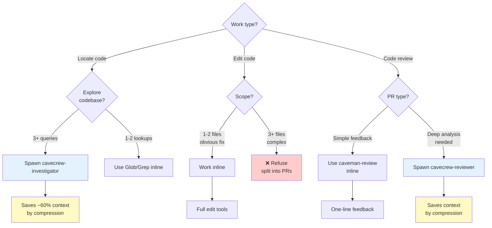

# Cavecrew Module — Flowchart

> **Module:** cavecrew  
> **Type:** Delegation Decision Matrix  
> **Purpose:** Decide WHEN to spawn subagent vs. inline work  
> **Subagents:** cavecrew-investigator (locate), cavecrew-builder (1-2 file edit), cavecrew-reviewer (diff review)

---

## Decision Matrix



---

## Subagent Types

### cavecrew-investigator
**Use for:** "Where is X defined?" "What calls Y?" "Map this directory"

**Output:** File:line table (compressed)

**Benefits:**
- Read-only code exploration
- ~60% smaller context than inline
- Fast repeated lookups

**Red Flags:**
- NOT for code generation
- NOT for modifications
- Only for read/grep/glob operations

---

### cavecrew-builder
**Use for:** Surgical 1-2 file edits

**Scope:**
- ✅ Typo fixes
- ✅ Single-function rewrites
- ✅ Mechanical renames
- ✅ Comment removal
- ✅ Format-preserving tweaks

**Refuse:**
- ❌ 3+ files (split into PRs)
- ❌ New features
- ❌ Cross-file refactors
- ❌ Architecture changes

**Output:** Diff receipt (exact changes)

---

### cavecrew-reviewer
**Use for:** Deep PR code review

**Approach:**
- One line per finding
- Severity-tagged
- No praise, actionable signal

**Format:**
```
path:line: 🔴 severity: problem. fix.
```

**Example:**
```
L42: 🔴 bug: user null after .find(). Add guard before .email.
L128: 🟡 risk: concurrent dict modification. Use lock.
L55: 🔵 nit: var name confusing. Rename to `expected_value`.
```

---

## When to Delegate

| Situation | Decide | Action |
|-----------|--------|--------|
| "Where's the X function?" | Is this 1-2 lookups or deep exploration? | Investigator if exploration |
| "Fix this typo in 3 files" | Are they related edits or separate? | Builder if 2 files max |
| "Review this PR" | Is this simple feedback or deep analysis? | Reviewer if depth needed |
| "Map dependencies" | Is codebase large? | Investigator saves context |

---

## Benefits Over Inline

| Benefit | How |
|---------|-----|
| Saves context | Compressed output ~60% smaller |
| Focused work | Agent doesn't inherit full history |
| Parallel | Can run while main thread coordinates |
| Quality | Specialized agents for specific tasks |

---

## When NOT to Delegate

- Work is 1-2 Glob/Grep queries → inline
- Edit is typo in one file → inline
- Simple feedback → inline caveman-review
- User needs continuity → inline (no context switch)

---

## Confidence

🟢 **CONFIRMADO** — Decision matrix clear, subagent scopes explicit, delegation benefits documented.

