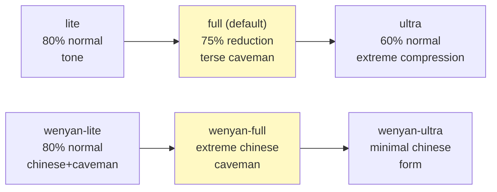

# Caveman Communication Module — Flowchart

> **Module:** caveman (+ variants)  
> **Type:** Communication  
> **Purpose:** Ultra-compressed output to reduce token usage  
> **Intensity Levels:** lite | full | ultra | wenyan-lite | wenyan-full | wenyan-ultra  
> **Reduction:** ~75% token savings with full technical accuracy

---

## Intensity Levels



---

## Transformation Rules (Full Mode)

### Drop
- ❌ Articles: a, an, the
- ❌ Filler: just, really, basically, actually, simply, basically
- ❌ Pleasantries: sure, certainly, of course, happy to
- ❌ Hedging: probably, maybe, seems, might

### Keep
- ✅ Technical terms: exact, no shortcuts
- ✅ Code blocks: unchanged
- ✅ Errors: quoted exact
- ✅ Names, paths, commands: full form

### Format
```
[thing] [action] [reason]. [next step].
```

### Examples

**Normal:** "Sure! I'd be happy to help you with that. The issue you're experiencing is likely caused by an authentication middleware bug where the token expiry check uses `<=` instead of `<`. Here's what I recommend we do to fix it:"

**Caveman:** "Bug in auth middleware. Token expiry check use `<` not `<=`. Fix:"

---

## Pattern Examples

| Normal | Caveman |
|--------|---------|
| "The function is probably overcomplicating things" | "Function overcomplicated" |
| "Just modify the config and it should work" | "Modify config" |
| "I'd really recommend using this approach" | "Use this approach" |
| "This might be a security issue" | "Security risk" |
| "The test file is located in the src directory" | "Test: src/test.ts" |

---

## Auto-Clarity (When to Drop Caveman)

Automatically drop caveman for:
- **Security warnings** ("WARNING: destructive operation")
- **Irreversible action confirmations** ("git push --force will overwrite")
- **Multi-step sequences** (where fragment order could cause misread)
- **User asks to clarify** (user repeats question)

Resume caveman after critical communication done.

---

## Session Control

**Enable caveman mode:**
```
user: "use caveman mode" / "talk like caveman" / "/caveman"
```

**Change intensity:**
```
/caveman lite|full|ultra|wenyan-*
```

**Disable caveman:**
```
user: "stop caveman" / "normal mode"
```

---

## Token Savings

| Mode | Reduction | Use Case |
|------|-----------|----------|
| lite | ~20% | Long conversations, low token pressure |
| full | ~75% | Default, balanced |
| ultra | ~85% | Extreme compression, expert users |
| wenyan-* | ~60-85% | Chinese speaker, cultural preference |

---

## Related Skills

- `caveman-commit` — Terse commit messages
- `caveman-review` — 1-line PR feedback
- `caveman-compress` — File lossless compression
- `caveman-help` — Quick reference card
- `caveman-stats` — Token usage reporting

---

## Confidence

🟢 **CONFIRMADO** — Levels documented, rules clear, auto-clarity triggers explicit.

