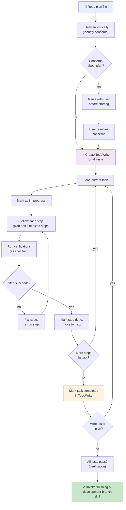

# Executing Plans Module — Flowchart

> **Module:** executing-plans  
> **Type:** Workflow  
> **Purpose:** Load and execute implementation plan in current or separate session  
> **Integration:** Requires writing-plans input, finishing-a-development-branch output

---

## Process Flow



---

## Step 1: Load and Review Plan

### 1.1 Read Plan File
- Load complete plan from specified path
- Understand all tasks and dependencies
- Note execution model (which this uses)

### 1.2 Review Critically
Look for:
- Missing steps or gaps
- Unclear instructions
- Unrealistic estimates
- Missing dependencies
- Potential blockers

### 1.3 Identify Concerns
If concerns exist:
- **DO NOT PROCEED**
- Raise specifically with user
- Wait for resolution
- Update plan if needed

---

## Step 2: Execute Tasks

**For each task in plan:**

### 2.1 Mark in_progress
Update TodoWrite:
```
- [x] Task 1
- [→] Task 2  (in_progress)
- [ ] Task 3
```

### 2.2 Follow Steps Exactly
- Don't reorder steps
- Don't skip steps
- Don't combine steps
- Follow plan precisely

### 2.3 Run Verifications
- Execute verification command specified
- Confirm expected output
- If fails: fix and re-run

### 2.4 Mark Task Completed
```
- [x] Task 1
- [x] Task 2  (completed)
- [ ] Task 3
```

---

## Step 3: Complete Development

**After all tasks verified:**

### 3.1 Verification Gate
```bash
# Run full test suite
npm test

# All pass?
```

### 3.2 Invoke Next Skill
**REQUIRED:** Use `superpowers:finishing-a-development-branch`
- Verify tests
- Present merge/PR/discard options
- Execute user's choice

---

## When to STOP and Ask for Help

**Stop executing immediately when:**

| Situation | Action |
|-----------|--------|
| Hit blocker (missing dependency, can't proceed) | Stop, ask for help |
| Plan has critical gaps | Stop, ask for clarification |
| Instruction is unclear | Stop, ask for explanation |
| Verification fails repeatedly | Stop, investigate, ask if needed |
| Test fails, root cause unclear | Stop, use systematic-debugging skill |

**Never guess through blockers.** Ask.

---

## Guardrails

| Rule | Reason |
|------|--------|
| Never start on main/master without explicit permission | Prevents accidental commits to primary branch |
| Follow plan steps exactly | Plan was designed with specific order/logic |
| Don't skip verifications | Verifications prevent silent failures |
| Use referenced skills when plan says to | Integration points are critical |
| Stop when blocked | Thrashing wastes time, asking is faster |

---

## Integration Points

```
writing-plans (input)
     ↓
executing-plans (this skill)
     ↓
finishing-a-development-branch (required output)
```

**Subskills used:**
- `using-git-worktrees` — ensure isolated workspace
- `test-driven-development` — if plan includes tests
- `systematic-debugging` — if issues arise
- `finishing-a-development-branch` — merge/PR decision

---

## Execution Models

This skill handles **sequential, same-session execution** of plans.

**Alternatives:**
- `subagent-driven-development` — Fresh subagent per task, two-stage review
- `dispatching-parallel-agents` — Independent task parallelization

Choose based on:
- Sequential = use this skill
- Independent tasks, same session = subagent-driven-development
- Parallel execution = dispatching-parallel-agents

---

## Confidence

🟢 **CONFIRMADO** — Process documented, decision points explicit, integration clear.

