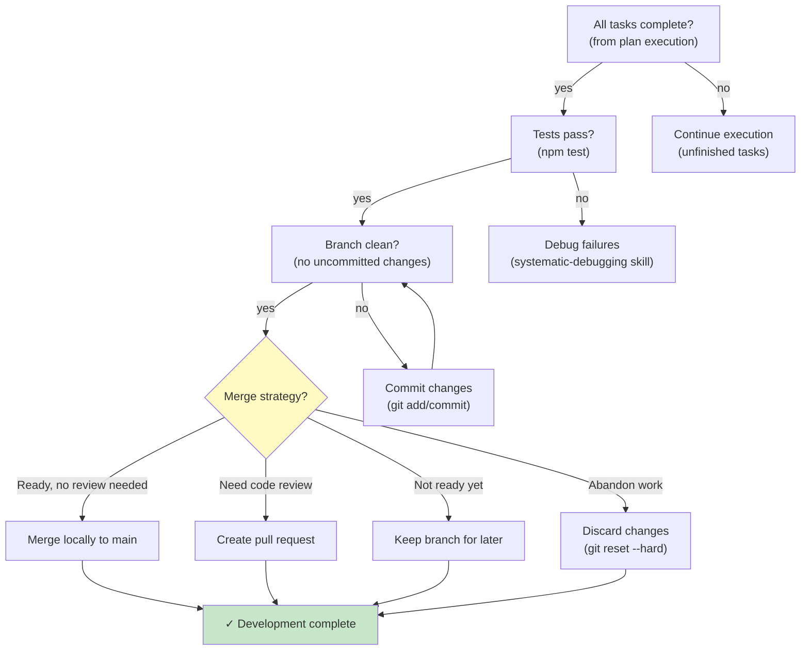

# Finishing a Development Branch Module — Flowchart

> **Module:** finishing-a-development-branch  
> **Type:** Workflow  
> **Purpose:** Decide merge/PR/keep/discard after feature complete  
> **Context:** After all tasks done, tests pass (from executing-plans or subagent-driven-development)

---

## Decision Tree



---

## Step 1: Verify Completion

```bash
# All tasks done?
npm test  # All pass?

# All committed?
git status  # Clean working tree?
```

If issues:
- ❌ Tests fail → use systematic-debugging
- ❌ Uncommitted changes → commit or discard
- ✅ Ready → proceed to decision

---

## Step 2: Merge Decision

Present user with 4 options:

### Option 1: Merge Locally
```bash
git checkout main
git merge feature/my-feature --ff-only
```

**Use when:**
- No review needed
- Direct integration to main
- Small, safe changes

---

### Option 2: Create Pull Request
```bash
gh pr create --title "..." --body "..."
# Requires GitHub remote
```

**Use when:**
- Code review needed
- Team collaboration
- Maintainability documentation

**PR includes:**
- Title (clear, <70 chars)
- Description (summary, test plan)
- Issue reference (if applicable)

---

### Option 3: Keep Branch
```bash
# Leave branch as-is
# Can return to later
git branch -v  # Shows branch and commits
```

**Use when:**
- Work not yet ready
- Waiting for feedback
- Parallel work continuing

**Exit worktree:**
```bash
cd ..
# worktree still exists, can return
```

---

### Option 4: Discard Changes
```bash
git reset --hard main
# Removes all commits, changes gone
```

**Use when:**
- Approach didn't work
- Abandoning feature
- Starting over

⚠️ **WARNING:** This is destructive and irreversible.

---

## Step 3: Execute Choice

**Merge locally:**
- Verify merged to main
- Delete branch (optional)
- Announce feature complete

**Create PR:**
- Share URL with team
- Wait for review
- Respond to feedback

**Keep branch:**
- Document reason
- Plan return date
- Note current status

**Discard:**
- Confirm final decision
- Backup notes if needed
- Move to next feature

---

## Guardrails

| Rule | Why |
|------|-----|
| Never merge main → feature | Prevents squashing main history |
| Always verify tests before merge | Catches regressions |
| Commit before deciding | Don't lose work |
| Ask user for final decision | User owns choice |

---

## Confidence

🟢 **CONFIRMADO** — Decision options clear, merge strategies documented, guardrails explicit.

