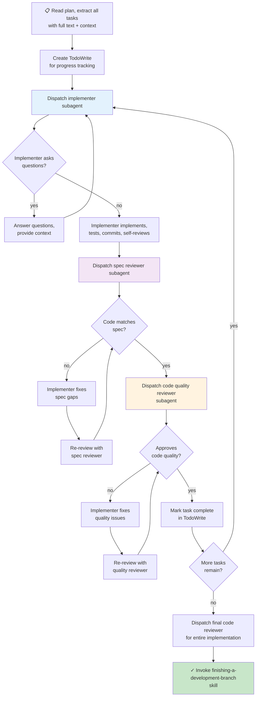

# Subagent-Driven Development Module — Flowchart

> **Module:** subagent-driven-development  
> **Type:** Workflow  
> **Purpose:** Execute plan via fresh subagent per task, with two-stage review  
> **Core:** Implementer → Spec Reviewer → Quality Reviewer → next task (continuous)

---

## Process Flow



---

## Key Phases

### Phase 1: Plan Loading
- Extract all tasks with full text
- Note context and dependencies
- Create TodoWrite for all tasks

---

### Phase 2: Per-Task Execution (Loop)

**For each task:**

#### 2a. Implementer Dispatch
```
Send to implementer subagent:
- Task ID and full text
- Complete context
- Relevant code snippets
- Spec reference
```

**Loop:** Implementer asks questions → Answer → Re-dispatch

**Exit:** Implementer produces working implementation + tests + self-review

#### 2b. Spec Compliance Review
```
Send to spec reviewer subagent:
- Task spec
- Implementer's code
- Test cases
- Commits
```

**Check:** Does code match spec exactly?

**If NO:** Implementer fixes spec gaps → re-review

**If YES:** Proceed to quality review

#### 2c. Code Quality Review
```
Send to quality reviewer subagent:
- Complete implementation
- All tests
- All commits
- Code style guide
```

**Check:** Is code clean, efficient, maintainable?

**If NO:** Implementer fixes quality issues → re-review

**If YES:** Mark task completed, proceed to next task

---

### Phase 3: Final Review (After All Tasks)
```
Dispatch final code reviewer for entire implementation:
- All tasks completed
- All code merged
- All tests passing
- Full diff review
```

---

## Continuous Execution (No Pauses)

**Important:** Execute all tasks without stopping to check in with user between tasks.

- **DO** execute all tasks continuously
- **DO** dispatch subagents sequentially
- **DO NOT** pause between tasks
- **DO NOT** ask "should I continue?"
- **DO** only stop if: BLOCKED, genuine ambiguity, or all tasks complete

---

## Model Selection

Choose model by task complexity:

| Task Type | Model |
|-----------|-------|
| Mechanical (isolated functions, clear spec, 1-2 files) | Fast/cheap |
| Integration (multi-file, pattern matching, coordination) | Standard |
| Architecture/design/review | Most capable |

---

## Subagent Prompts (Reference)

**Implementer prompt:** `./implementer-prompt.md`
**Spec reviewer prompt:** `./spec-reviewer-prompt.md`
**Quality reviewer prompt:** `./code-quality-reviewer-prompt.md`

Each subagent receives:
- Task description (don't reference plan file)
- Full context needed
- Spec reference
- Previous iterations (if fix loop)

---

## Two-Stage Review Loop

```
Task Code Created
    ↓
[Stage 1: Spec Compliance]
    Does it match spec? → NO → implementer fixes → re-review
                      → YES → continue
    ↓
[Stage 2: Code Quality]
    Is code clean? → NO → implementer fixes → re-review
                   → YES → task complete
```

**Benefits:**
- Spec review catches logic errors
- Quality review catches style/efficiency
- Fresh subagent per stage = unbiased review
- Implementer can iterate without context switching main session

---

## Confidence

🟢 **CONFIRMADO** — Process flow documented, subagent dispatch clear, two-stage review explicit.

