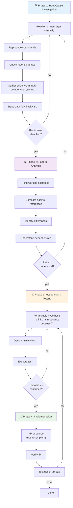

# Systematic Debugging Module — Flowchart

> **Module:** systematic-debugging  
> **Type:** Discipline  
> **Purpose:** Find root cause before attempting fixes  
> **Iron Law:** NO FIXES WITHOUT ROOT CAUSE INVESTIGATION FIRST

---

## Four Phases (Sequential)



---

## Phase 1: Root Cause Investigation

**Never propose fixes without completing Phase 1.**

### 1.1 Read Error Messages Carefully
- Don't skip errors or warnings
- Stack traces often contain exact solution
- Read COMPLETELY, note line numbers
- Don't jump to conclusions

### 1.2 Reproduce Consistently
- Can you trigger reliably?
- What are exact steps?
- Every time, or intermittent?
- If not reproducible → gather more data, don't guess

### 1.3 Check Recent Changes
```bash
git log -5 --oneline
git diff HEAD~5
```
- What changed recently?
- New dependencies?
- Config changes?
- Environment differences?

### 1.4 Gather Evidence (Multi-Component Systems)

**For systems with multiple layers (CI → build → signing, API → service → database):**

```bash
# Layer 1: Workflow/CI
echo "IDENTITY: ${IDENTITY:+SET}${IDENTITY:-UNSET}"

# Layer 2: Build script
env | grep IDENTITY || echo "IDENTITY not in environment"

# Layer 3: Signing script  
security list-keychains
security find-identity -v

# Layer 4: Actual operation
codesign --sign "$IDENTITY" --verbose=4 "$APP"
```

**Result:** Reveals which layer fails

### 1.5 Trace Data Flow (Deep Call Stack)

**Work BACKWARD from symptom:**

1. Where does bad value originate?
2. What called this with bad value?
3. Keep tracing up until source found
4. **Fix at source, not at symptom**

---

## Phase 2: Pattern Analysis

**Find working pattern before fixing.**

### 2.1 Find Working Examples
- Locate similar working code in codebase
- What works that's similar to broken?
- Compare side-by-side

### 2.2 Compare Against References
- If implementing pattern, read reference COMPLETELY
- Don't skim — read every line
- Understand fully before applying

### 2.3 Identify Differences
- List every difference between working and broken
- Don't assume "that can't matter"
- Check: initialization, config, dependencies, error handling

### 2.4 Understand Dependencies
- What other components needed?
- What settings, config, environment?
- What assumptions does pattern make?

---

## Phase 3: Hypothesis and Testing

**Scientific method before implementing.**

### 3.1 Form Single Hypothesis
```
"I think [X] is root cause because [Y]"
```
- Clear, testable statement
- Based on evidence from Phase 1-2
- One hypothesis at a time

### 3.2 Design Minimal Test
- What's the smallest change to test hypothesis?
- What output proves/disproves?
- Can you run it in < 2 minutes?

### 3.3 Execute Test
```bash
# Make ONE small change
# Run test
# Observe result
```

### 3.4 Confirm/Refute
- **Confirmed:** Hypothesis correct, proceed to Phase 4
- **Refuted:** Back to Phase 2 (pattern analysis)
- **Inconclusive:** Refine hypothesis, test again

---

## Phase 4: Implementation

### 4.1 Fix at Source
- Apply fix where root cause originates
- Not where symptom appears
- Smallest change to address root cause

### 4.2 Verify Fix
```bash
npm test  # All tests pass?
npm run lint  # No warnings?
# Reproduce original issue — does it work now?
```

### 4.3 Commit Fix
```bash
git add .
git commit -m "fix: [description of root cause]"
```

---

## Red Flags (Rationalization Patterns)

| Situation | Red Flag | Correct Action |
|-----------|----------|-----------------|
| Under time pressure | "Just one quick fix" | STOP, run systematic (faster than thrashing) |
| Already tried multiple fixes | "Try this too" | Go back to Phase 1, find root cause |
| Simple seeming issue | "Doesn't need investigation" | Investigate anyway (simple bugs have roots) |
| Unfamiliar code | "I don't understand this" | STOP, investigate until you do |
| Test failing intermittently | "Probably flaky test" | Investigate (flakiness has root cause) |
| "Everyone does it this way" | Reference pattern without understanding | Read reference completely, understand first |

---

## Flow Summary

**MANDATORY SEQUENCE:**

1. **Phase 1:** Investigate until root cause identified
2. **Phase 2:** Understand pattern from working examples
3. **Phase 3:** Form and test hypothesis
4. **Phase 4:** Implement fix at source
5. **Verify:** All tests pass, issue resolved

**NO SKIPPING PHASES.** "It's probably X" is not investigation.

---

## Confidence

🟢 **CONFIRMADO** — Four-phase structure documented, evidence gathering techniques detailed, anti-patterns cataloged.

