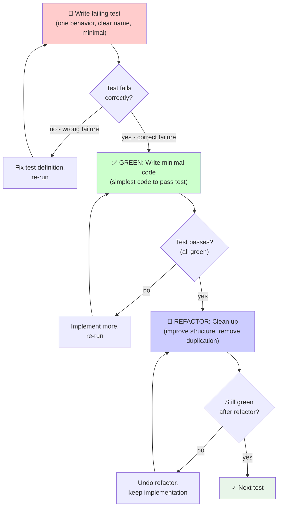

# Test-Driven Development Module — Flowchart

> **Module:** test-driven-development (TDD)  
> **Type:** Discipline  
> **Purpose:** Enforce test-first development, prevent untested code  
> **Core:** RED → GREEN → REFACTOR cycle, MANDATORY failing test

---

## RED-GREEN-REFACTOR Cycle



---

## Iron Law: NO PRODUCTION CODE WITHOUT FAILING TEST

```
IF you wrote code before test → DELETE CODE and start over
NEVER keep code as "reference"
NEVER "adapt" it while writing tests
NEVER skip watching test fail
```

---

## Phase 1: RED — Write Failing Test

**Objective:** Prove the test fails correctly before implementing

**Steps:**
1. Write ONE minimal test showing required behavior
2. Test name describes WHAT, not HOW
3. Use real code (minimize mocks)
4. One behavior per test

**Good Test Example:**
```typescript
test('retries failed operations 3 times', async () => {
  let attempts = 0;
  const operation = () => {
    attempts++;
    if (attempts < 3) throw new Error('fail');
    return 'success';
  };
  
  const result = await retryOperation(operation);
  
  expect(result).toBe('success');
  expect(attempts).toBe(3);
});
```

**Red Flags:**
- Test is vague ("test works", "tests behavior")
- Mock-heavy (testing mock, not code)
- Multiple behaviors in one test
- No clear failure message

---

## Phase 1b: Verify RED — Watch It Fail

**MANDATORY. Never skip.**

**Command:**
```bash
npm test path/to/test.test.ts
```

**Verification Checklist:**
- [ ] Test FAILS (not errors)
- [ ] Failure message makes sense
- [ ] Fails because feature missing (not typos/config)
- [ ] Test doesn't already pass (not testing existing behavior)

**If test passes:** You're testing existing behavior. Fix or delete test.

**If test errors:** Fix error, re-run until it fails correctly.

---

## Phase 2: GREEN — Minimal Code

**Objective:** Write simplest code to pass test, nothing more

**Principle:** YAGNI — You Aren't Gonna Need It

**Example:**
```typescript
async function retryOperation<T>(fn: () => Promise<T>): Promise<T> {
  for (let i = 0; i < 3; i++) {
    try {
      return await fn();
    } catch (e) {
      if (i === 2) throw e;
    }
  }
  throw new Error('unreachable');
}
```

**Red Flags:**
- Adding features not required by test
- Premature optimization
- Over-engineered architecture
- Error handling beyond test scope

---

## Phase 2b: Verify GREEN — All Tests Pass

**Command:**
```bash
npm test
```

**Checklist:**
- [ ] New test PASSES
- [ ] All existing tests PASS
- [ ] No warnings or failures

**If tests fail:** Fix code, re-run. Do NOT delete test.

---

## Phase 3: REFACTOR — Clean Up

**Objective:** Improve code structure WITHOUT changing behavior

**Allowed Actions:**
- Extract functions
- Rename variables for clarity
- Remove duplication
- Reorganize logic flow
- Simplify conditionals

**Forbidden Actions:**
- Add features
- Change test behavior
- Modify API surface
- Add edge case handling

**Verification Loop:**
```
REFACTOR → run tests → tests pass? 
  YES → next cycle
  NO → undo refactor, keep previous version → try again
```

---

## Red Flags (All Phases)

| Phase | Red Flag | Action |
|-------|----------|--------|
| RED | Test passes on first run | DELETE test, you're testing existing behavior |
| RED | Test has multiple assertions for different things | SPLIT into separate tests |
| RED | Test is mocking 80% of dependencies | RETHINK test design, use real code |
| GREEN | Code feels over-engineered | SIMPLIFY to minimum passing |
| GREEN | "I'll refactor later" | REFACTOR NOW, this is when it's safe |
| GREEN | New test passes but old test breaks | REGRESSION — fix immediately |
| REFACTOR | "Refactoring" adds features | UNDO — that's not refactoring |
| REFACTOR | Tests fail during refactor, you "fix tests" | UNDO refactor, don't redefine test |

---

## Flow Summary (Per Feature)

1. **RED:** Write failing test showing required behavior
2. **Verify RED:** Confirm test fails correctly
3. **GREEN:** Write minimal code to pass test
4. **Verify GREEN:** Confirm test passes, no regressions
5. **REFACTOR:** Improve code structure
6. **Verify REFACTOR:** Confirm refactoring didn't break tests
7. **REPEAT** for next feature

---

## When to Skip (Ask User)

- Throwaway prototypes (temporary, will delete)
- Generated code (from generators, templates)
- Configuration files (pure data, not logic)

**Default:** Never skip. "Just this once" is rationalization.

---

## Confidence

🟢 **CONFIRMADO** — Core cycle documented, phases explicit, anti-patterns cataloged, examples provided.

