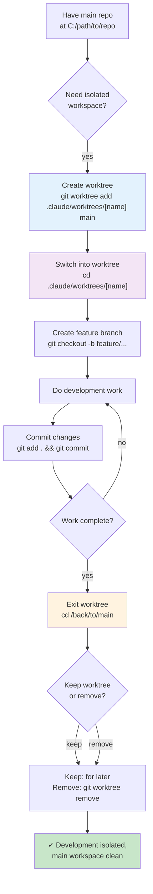

# Using Git Worktrees Module — Flowchart

> **Module:** using-git-worktrees  
> **Type:** Workflow  
> **Purpose:** Create isolated workspaces for feature development  
> **Benefit:** Clean branch history, no interference with main workspace

---

## Process Flow



---

## Step 1: Create Worktree

```bash
git worktree add .claude/worktrees/feature-name main
```

**Options:**
- Creates new branch automatically
- Uses `.claude/worktrees/` location (standard)
- Can use any branch as base (main, develop, etc.)

**Verification:**
```bash
git worktree list
# Output: /path/to/.claude/worktrees/feature-name  [branch-name]
```

---

## Step 2: Switch Into Worktree

```bash
cd .claude/worktrees/feature-name
```

**Key point:** You're now in isolated workspace
- Separate git index
- Separate working directory
- Main repo untouched

---

## Step 3: Create Feature Branch

```bash
git checkout -b feature/my-feature main
# or use existing branch from worktree creation
```

---

## Step 4: Develop

- Normal git workflow (edit, test, commit)
- All changes stay in worktree
- Main repo remains clean

---

## Step 5: Commit

```bash
git add .
git commit -m "feat: description"
```

---

## Step 6: Exit Worktree

```bash
cd /back/to/main
```

Return to original repository directory.

---

## Step 7: Manage Worktree

**Keep worktree:**
```bash
# Leave it for later use
# Can re-enter with: cd .claude/worktrees/feature-name
```

**Remove worktree:**
```bash
git worktree remove .claude/worktrees/feature-name
# Removes directory and git metadata
# Branch remains in local repo
```

---

## Why Use Worktrees

| Benefit | Why |
|---------|-----|
| Isolated workspace | Don't affect main development |
| Clean branch history | Each branch isolated |
| Multiple branches at once | Work on feature-a and feature-b simultaneously |
| No stashing needed | Leave changes in place |
| Separate git index | No conflicts with main workspace |

---

## Worktree vs. Stash

| Scenario | Use |
|----------|-----|
| Switch branches temporarily, come back | Git stash |
| Long-lived feature branch | Git worktree |
| Multi-file changes, complex work | Git worktree |
| One-off switch | Git checkout |

---

## Red Flags

| Issue | Action |
|-------|--------|
| "Main branch has my changes" | Commit to worktree first, don't work on main |
| "Worktree is locked" | Another process using it, check git worktree list |
| "Can't remove worktree" | Commit changes, clean up untracked files, retry |

---

## Confidence

🟢 **CONFIRMADO** — Worktree creation clear, isolation guaranteed, management documented.

