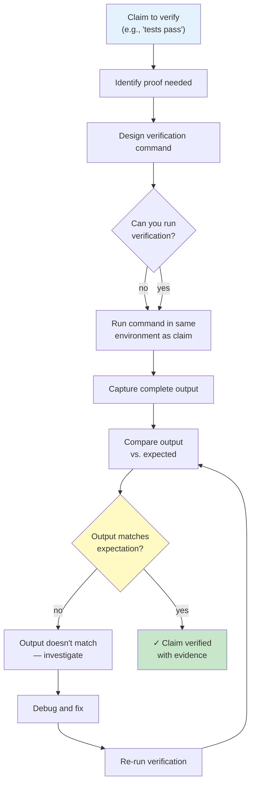

# Verification Before Completion Module — Flowchart

> **Module:** verification-before-completion  
> **Type:** Discipline  
> **Purpose:** Provide proof before claiming work is done  
> **Iron Law:** NO CLAIMS WITHOUT EVIDENCE

---

## Process Flow



---

## Verification Types

### Type 1: Tests Pass
```bash
npm test
# Expected: ✓ all pass, exit code 0
```

### Type 2: Build Succeeds
```bash
npm run build
# Expected: no errors, exit code 0
```

### Type 3: Linting Passes
```bash
npm run lint
# Expected: no violations, exit code 0
```

### Type 4: Feature Works
```bash
npm start
# Expected: server running, logs show ready
```

### Type 5: Integration Test
```bash
curl http://localhost:3000/api/users
# Expected: 200 OK, valid JSON
```

---

## Red Flags

| Claim | Red Flag | Fix |
|-------|----------|-----|
| "Tests pass" | No test output shown | Run tests, show output |
| "Build works" | Skipped verification | Run build, show output |
| "Feature done" | "I tested it locally" | Run test suite, show results |
| "No errors" | "No errors shown" | Run linter, show output |
| "It works now" | Didn't re-run original failing case | Reproduce original issue, prove it's fixed |

---

## Evidence Template

**Claim:** `[what you're claiming]`
**Command:** `[exact command run]`
**Output:** `[complete stdout/stderr]`
**Exit Code:** `[0 = success, non-zero = failure]`
**Passed:** `[yes/no]`

---

## Integration Points

Used by:
- TDD (verify test fails, then passes)
- Systematic Debugging (verify fix works)
- Executing Plans (verify each step)
- Subagent-Driven Dev (verify each task)

---

## Confidence

🟢 **CONFIRMADO** — Verification types clear, red flags documented, evidence format explicit.

