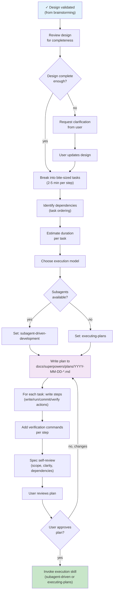

# Writing Plans Module — Flowchart

> **Module:** writing-plans  
> **Type:** Workflow  
> **Purpose:** Create detailed implementation plan from validated design  
> **Input:** Design doc (from brainstorming)  
> **Output:** Implementation plan (to executing-plans or subagent-driven-development)

---

## Process Flow



---

## Step 1: Review Design

Verify design is ready:
- All sections present
- No ambiguities or TBD placeholders
- Architecture clear
- Dependencies identified
- Error handling defined
- Testing strategy defined

**If gaps:** Request user clarification, update design

---

## Step 2: Break Into Tasks

Create bite-sized tasks:
- Each 2-5 minutes of work
- One clear objective per task
- Ordered by dependencies
- No task too large for single context window

**Example breakdown:**
```
Task 1: Create data model
  Step 1: Write test for User interface
  Step 2: Implement User type
  Step 3: Commit

Task 2: Write API endpoint
  Step 1: Write test for POST /users
  Step 2: Implement endpoint handler
  Step 3: Add error handling
  Step 4: Test with curl
  Step 5: Commit

Task 3: Add validation
  Step 1: Write test for invalid input
  Step 2: Implement validator
  Step 3: Integrate with endpoint
  Step 4: Commit
```

---

## Step 3: Identify Dependencies

Map task ordering:
```
Task 1 (data model)
  ↓
Task 2 (API endpoint) — depends on Task 1
  ↓
Task 3 (validation) — depends on Task 1 & 2
```

Flag in plan: `depends_on: [1]`

---

## Step 4: Estimate Duration

Per step:
- Simple write/run/commit: 2-3 min
- Complex logic: 5-10 min
- Testing: 3-5 min per test
- Verification/debug: 2-5 min

Total per task: Sum of steps

---

## Step 5: Choose Execution Model

**If subagents available:**
→ `subagent-driven-development` (fresh subagent per task, two-stage review)

**If no subagents:**
→ `executing-plans` (sequential execution, human-in-loop)

Note in plan:
```
execution_model: subagent-driven-development
```

---

## Step 6: Write Plan Document

Location: `docs/superpowers/plans/YYYY-MM-DD-<feature>.md`

**Content:**
```markdown
# Implementation Plan — [Feature Name]

## Overview
- Goal: [one sentence]
- Architecture: [2-3 sentences]
- Tech stack: [list]
- Execution model: [which skill]

## Tasks

### Task 1: [Title]
- Objective: [what this accomplishes]
- Files: create, modify, test

#### Step 1: [Action]
- write/run/commit/verify
- Verification command: `npm test`
- Expected output: `✓ all pass`

[repeat for all steps]

### Task 2: [Title]
[same structure]
```

---

## Step 7: Add Verification Per Step

Each step includes:
- **action:** write | run | commit | verify
- **verification_command:** Exact command to prove success
- **expected_output:** What success looks like

Example:
```
Step 2: Implement retry function
- Run: npm test src/retry.test.ts
- Expected: ✓ 1 test passed
```

---

## Step 8: Spec Self-Review

Check plan for:
- **Scope:** Is each task focused?
- **Completeness:** Any missing steps?
- **Clarity:** Can someone execute without questions?
- **Dependencies:** Correct order?
- **Verification:** Each step has proof?

Fix issues inline.

---

## Step 9: User Review

Ask user:
```
Plan written to [path]. Please review:
- Does execution order make sense?
- Are steps clear?
- Any concerns about approach?

I'll wait for your approval before we start.
```

**If changes:** Update plan, re-review, re-present

**If approved:** Proceed to execution

---

## Execution Model Decision

```
┌─────────────────────────────────────┐
│ Have implementation plan?           │
│  YES → continue                     │
│  NO → write plan first              │
└─────────────────────────────────────┘
           ↓
┌─────────────────────────────────────┐
│ Tasks mostly independent?           │
│  YES → can be parallelized          │
│  NO → sequential execution needed   │
└─────────────────────────────────────┘
           ↓
┌─────────────────────────────────────┐
│ Execute in same session?            │
│  YES → subagent-driven (fresh per   │
│        task) OR executing-plans     │
│  NO → executing-plans (separate     │
│       session)                      │
└─────────────────────────────────────┘
```

---

## Confidence

🟢 **CONFIRMADO** — Plan structure documented, step format clear, verification requirements explicit.

