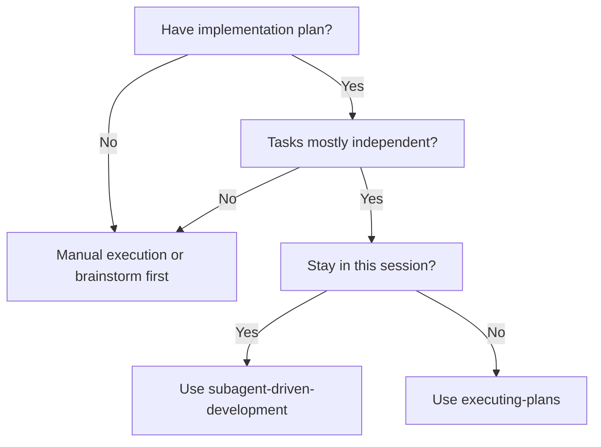
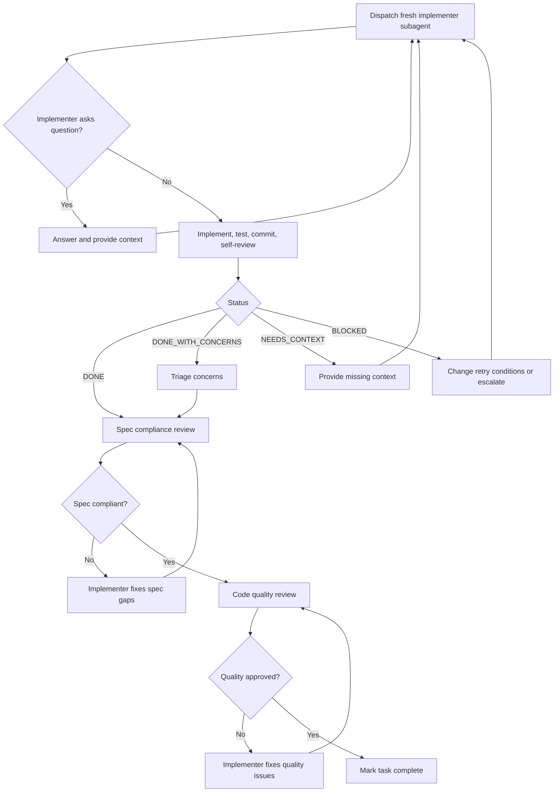

# Subagent-Driven Development — Design

> Technical design for same-session implementation-plan execution using fresh subagents and mandatory two-stage review gates.

## Interface

**Trigger condition:** The skill is used when an agent is executing an implementation plan, tasks are mostly independent, and the user wants to stay in the current session. 🟢

**Primary input:** An implementation plan already available to the controller. The plan is not delegated as a file-reading task; the controller extracts full task text and passes it directly to each subagent. 🟢

```markdown
# Implementation Plan

- [ ] Task 1: Implement focused change A
  - Requirements: ...
  - Acceptance criteria: ...

- [ ] Task 2: Implement focused change B
  - Requirements: ...
  - Acceptance criteria: ...
```

**Per-task implementer prompt:** Uses `skills/subagent-driven-development/implementer-prompt.md`. 🟢

```text
You are implementing Task N: [task name]

## Task Description
[FULL TEXT of task from plan]

## Context
[Scene-setting: dependencies, architecture, where this fits]

## Your Job
1. Implement exactly what the task specifies
2. Write tests
3. Verify implementation works
4. Commit your work
5. Self-review
6. Report back
```

**Implementer output contract:** 🟢

| Field | Type | Meaning |
|-------|------|---------|
| `Status` | enum | `DONE`, `DONE_WITH_CONCERNS`, `BLOCKED`, or `NEEDS_CONTEXT` |
| `What implemented` | text | Summary of completed or attempted changes |
| `Tests` | text | Tests run and results |
| `Files changed` | list | Files modified by the task |
| `Self-review findings` | text | Findings discovered during implementer self-review |
| `Issues or concerns` | text | Doubts, blockers, or scope concerns |

**Review outputs:** 🟢

| Reviewer | Input | Output |
|----------|-------|--------|
| Spec compliance reviewer | Full task requirements, implementer report, actual code | `✅ Spec compliant` or `❌ Issues found` with file references |
| Code quality reviewer | Task summary, requirements, base SHA, head SHA, actual diff | Strengths, Critical/Important/Minor issues, assessment |

## Main Flow

1. Read the implementation plan once and extract every task with full text and context. 🟢
2. Create a task tracker for all extracted tasks. 🟢
3. Select the next pending task. 🟢
4. Dispatch a fresh implementer subagent using the implementer prompt template. 🟢
5. If the implementer asks a question, answer it with missing requirements, context, dependency information, or assumptions before work proceeds. 🟢
6. The implementer implements, tests, commits, self-reviews, and reports status. 🟢
7. Interpret implementer status. 🟢
8. If the task is ready for review, dispatch the spec compliance reviewer. 🟢
9. If spec review finds issues, route those findings back to the implementer and repeat spec review after fixes. 🟢
10. After spec compliance passes, dispatch the code quality reviewer. 🟢
11. If code quality review finds issues, route those findings back to the implementer and repeat quality review after fixes. 🟢
12. When both reviews pass, mark the task complete in the task tracker. 🟢
13. Continue to the next task without asking the user whether to proceed. 🟢
14. After all tasks complete, dispatch a final code reviewer for the entire implementation. 🟢
15. Invoke `finishing-a-development-branch` to complete branch-level workflow. 🟢

## Decision Flow



🟢 Evidence: `skills/subagent-driven-development/SKILL.md` "When to Use" graph.

## Per-Task Review Loop



🟢 Evidence: `skills/subagent-driven-development/SKILL.md` "The Process" graph and "Handling Implementer Status".

## Alternative Flows

- **No implementation plan:** The skill is not selected; the agent should perform manual execution or brainstorm first. 🟢
- **Tasks are tightly coupled:** The skill is not selected; tightly coupled work requires another execution strategy. 🟢
- **User does not want same-session execution:** Use `executing-plans` rather than this skill. 🟢
- **Implementer reports `DONE_WITH_CONCERNS`:** Read concerns before proceeding. If concerns affect correctness or scope, resolve them before review; if they are observations, note them and continue to review. 🟢
- **Implementer reports `NEEDS_CONTEXT`:** Provide the missing context and re-dispatch the task. 🟢
- **Implementer reports `BLOCKED`:** Assess whether the blocker requires more context, a stronger model, task splitting, or human escalation. 🟢
- **Spec reviewer finds missing or extra behavior:** Fix with the implementer and run spec review again before quality review. 🟢
- **Code quality reviewer finds Critical or Important issues:** Fix with the implementer and run quality review again before task completion. 🟡
- **Final reviewer finds broad integration problems:** The skill implies review before branch finishing, but the exact remediation loop for final review is not specified. 🔴

## Dependencies

- `skills/subagent-driven-development/implementer-prompt.md` — implementer dispatch template and report contract. 🟢
- `skills/subagent-driven-development/spec-reviewer-prompt.md` — spec compliance reviewer template. 🟢
- `skills/subagent-driven-development/code-quality-reviewer-prompt.md` — quality review template wrapper. 🟢
- `skills/requesting-code-review/code-reviewer.md` — standard code reviewer prompt used by quality review. 🟢
- `superpowers:using-git-worktrees` — required workflow skill for isolated workspace setup. 🟢
- `superpowers:writing-plans` — upstream skill that creates the plan to execute. 🟢
- `superpowers:requesting-code-review` — required quality review workflow. 🟢
- `superpowers:finishing-a-development-branch` — completion workflow after all tasks and reviews. 🟢
- `superpowers:test-driven-development` — recommended for subagents executing implementation tasks. 🟢
- Harness-specific subagent dispatch API — exact implementation depends on Claude Code, Codex, Cursor, OpenCode, Gemini, or another engine. 🟡

## Design Decisions Identified

| Decision | Evidence | Confidence |
|----------|----------|------------|
| Use fresh subagent per task | `skills/subagent-driven-development/SKILL.md:8`, `skills/subagent-driven-development/SKILL.md:12` | 🟢 |
| Controller curates context instead of passing session history | `skills/subagent-driven-development/SKILL.md:10` | 🟢 |
| Execute continuously without user check-ins between tasks | `skills/subagent-driven-development/SKILL.md:14` | 🟢 |
| Enforce spec review before code quality review | `skills/subagent-driven-development/SKILL.md:77`, `skills/subagent-driven-development/SKILL.md:249` | 🟢 |
| Keep implementation subagents sequential | `skills/subagent-driven-development/SKILL.md:242` | 🟢 |
| Treat implementer status as a state machine | `skills/subagent-driven-development/SKILL.md:104` | 🟢 |
| Use model selection based on task complexity | `skills/subagent-driven-development/SKILL.md:89` | 🟢 |
| Require final code review after all tasks | `skills/subagent-driven-development/SKILL.md:84` | 🟢 |
| Use task tracker named `TodoWrite` | `skills/subagent-driven-development/SKILL.md:60`, `skills/subagent-driven-development/SKILL.md:135` | 🟡 |

## Internal State

The skill does not define a persisted state file. Runtime state is maintained by the controller in session context and task tracker. 🟢

```typescript
interface SubagentDrivenSession {
  planText: string;
  tasks: Task[];
  currentTaskIndex: number;
  completedTaskIds: string[];
  activeImplementer: SubagentRun | null;
  reviewState: ReviewState | null;
}

interface Task {
  id: string;
  title: string;
  fullText: string;
  context: string;
  status: "pending" | "implementing" | "spec-review" | "quality-review" | "complete" | "blocked";
  implementerReport: ImplementerReport | null;
  specReview: ReviewResult | null;
  qualityReview: ReviewResult | null;
}

interface ImplementerReport {
  status: "DONE" | "DONE_WITH_CONCERNS" | "BLOCKED" | "NEEDS_CONTEXT";
  implemented: string;
  tests: string;
  filesChanged: string[];
  selfReviewFindings: string;
  concerns: string | null;
}

interface ReviewResult {
  approved: boolean;
  issues: ReviewIssue[];
  reviewedAt: string;
}
```

🟡 The TypeScript shape is inferred from the documented prompts and process graph; no executable code defines this schema.

## Observability

The legacy skill is markdown-only and does not define structured logs, metrics, or traces. 🔴

Expected operational signals are textual reports emitted by the controller and subagents: 🟡

- Task dispatch description: `Implement Task N: [task name]`. 🟢
- Implementer status report with changed files and tests. 🟢
- Spec reviewer verdict: `✅ Spec compliant` or `❌ Issues found`. 🟢
- Code reviewer report with strengths, issues, and assessment. 🟢
- Task tracker update after both review gates pass. 🟢
- Final code reviewer report before branch finishing. 🟢

## Risks and Gaps

- 🟡 Harness dispatch semantics require a capability adapter. The skill describes subagent behavior, but exact spawn, isolation, and filesystem-sharing guarantees vary by engine.
- 🔴 The final code review remediation loop is not explicitly defined if broad integration issues are found after all per-task gates pass.
- 🟡 `TodoWrite` is named as the tracker, but cross-engine availability is not guaranteed.
- 🟡 Model selection is qualitative; exact model names, cost thresholds, and escalation policies are not encoded.
- 🟡 Sequential implementation avoids conflicts, but the shared-worktree behavior of subagents remains engine-specific.
- 🟡 The skill says implementers commit their work, but exact git branch safety depends on `using-git-worktrees` and the surrounding engine permissions.
- 🟢 The skill explicitly forbids skipping reviews, dispatching parallel implementers, moving on with open review issues, and asking subagents to read the plan file.

## Reviewer Validation Addendum

- Question 6 answered: all listed engines are first-class targets for skill loading and workflow semantics. Rich subagent semantics should use native Claude Code/Codex-style APIs when present; other engines map through native mechanisms or degrade gracefully to inline execution/manual review.
- Question 6 answered: define shared concepts such as `dispatch_agent`, `review_agent`, isolated context, task ownership, and result status, then map those concepts per host.
